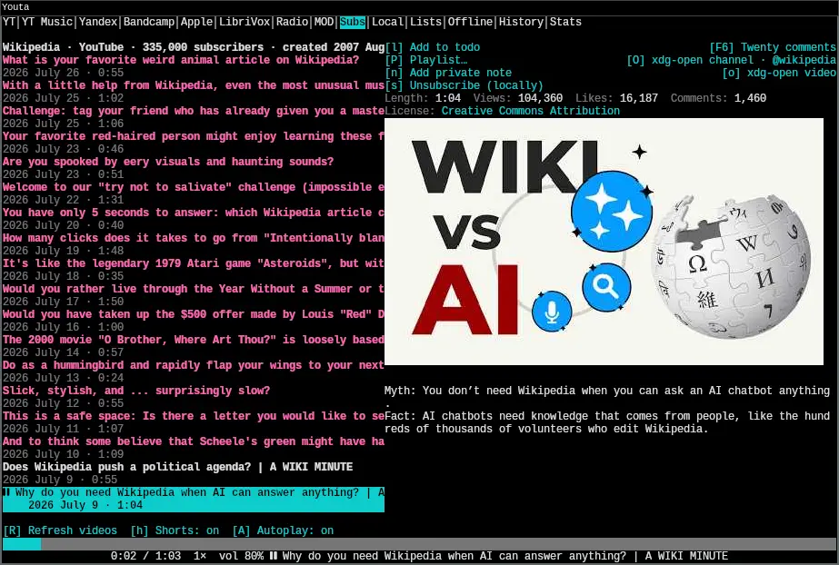

# Youta

[](https://github.com/vitaly-zdanevich/youta/actions/workflows/ci.yml)
[](https://sonarcloud.io/summary/new_code?id=vitaly-zdanevich_youta)
[](https://sonarcloud.io/summary/new_code?id=vitaly-zdanevich_youta)
[](https://sonarcloud.io/summary/new_code?id=vitaly-zdanevich_youta)
[](https://sonarcloud.io/summary/new_code?id=vitaly-zdanevich_youta)
[](https://sonarcloud.io/summary/new_code?id=vitaly-zdanevich_youta)
[](https://sonarcloud.io/summary/new_code?id=vitaly-zdanevich_youta)
[](https://sonarcloud.io/summary/new_code?id=vitaly-zdanevich_youta)
[](https://sonarcloud.io/summary/new_code?id=vitaly-zdanevich_youta)
[](https://sonarcloud.io/summary/new_code?id=vitaly-zdanevich_youta)
[](https://sonarcloud.io/summary/new_code?id=vitaly-zdanevich_youta)
[](https://sonarcloud.io/summary/new_code?id=vitaly-zdanevich_youta)




Youta is a low-resource audio player and subscription manager written in Rust,
with terminal and desktop front-ends. It saves and shows listening progress.
Subscriptions are currently stored and managed locally; YouTube-account
synchronization is not implemented yet. Youta uses an invisible `mpv` process
for playback, communicates with it over JSON IPC, and uses `yt-dlp` for
supported media resolution and downloads. Both front-ends share the same seek
bar, queue, volume, pause state, actions, and persistent controller state.

## Quick start

Install `mpv` 0.38 or newer and `yt-dlp`, then build and open the terminal player
with Rust 1.95 or newer:

```sh
cargo run --release --locked
```

Press `?` for contextual Help. Use `Tab` / `Shift+Tab` to switch sources,
`j` / `k` to select an item, `Enter` to open or play it, and `Space` to pause.
`/` searches the current source or edits the Web address; `p` or `F7` opens
Preferences. The first YouTube search offers API-key or Invidious setup.
YouTube Music search needs neither; Local, Web, and Radio need no account.

For installation alternatives, optional helpers, credentials, and smaller
builds, see [Build and run](#build-and-run). For the desktop front-end, see
[The desktop window](#the-desktop-window).

## Contents

- [Design](#why-this-design), [playback and queue](#the-mpv-backend-and-the-tui),
  and [supported sources](#current-foundation)
- [Local files and archives](#local-files-and-archives) and [Web directories](#web-directories)
- [Build and run](#build-and-run) and [desktop window](#the-desktop-window)
- [State and OPML](#human-readable-state-opml-and-optional-sqlite),
  [private notes](#private-notes), and [playlists](#local-playlists-and-todo)
- [Online discovery](#online-discovery-and-yt-dlp),
  [captions](#youtube-captions), and [summaries](#codex-video-summaries)
- [SponsorBlock](#sponsorblock), [DeArrow titles](#dearrow-titles),
  [rainbow seek bar](#rainbow-nyan-cat-seek-bar), and
  [audio visualization](#fullscreen-audio-visualization)
- [Thumbnails](#thumbnails-and-real-ttys) and
  [virtual-console mouse input](#mouse-input-on-a-linux-virtual-console)
- [Subscriptions and preferences](#subscriptions-and-local-data),
  [channel downloads and LAN podcast feeds](#full-channel-downloads-and-session-lan-feeds)
- [Commons uploads](#wikimedia-commons-transfer) and [Evernote notes](#evernote-audio-notes)
- [Diagnostics](#diagnostics-and-issue-review), [audio quality](#audiophiles),
  and [packaging and tests](#packaging-and-quality)
- [Roadmap](#service-roadmap), [license](#license),
  [related Wikimedia projects](#my-other-wikimedia-related-projects), and
  [similar terminal players](#similar-terminal-youtube-projects)
- [Talks and articles](#talks-and-articles)

## Why this design

- The UI stays responsive while network, metadata, and playback work happen
  outside the render loop.
- Persistent state is local-first and restartable. Youta stores navigation,
  queue, playlists, history, notes, bookmarks, and playback positions beneath
  `~/.config/youta/`.
- Optional providers are isolated behind Cargo features, so a local/RSS-only
  build does not need YouTube or cloud integrations.
- A plain Linux TTY is a primary target. A confirmed local `/dev/ttyN` can use
  Unicode half-block thumbnails; unsupported, remote, and serial terminals
  remain text-only.

See [Architecture](docs/ARCHITECTURE.md), [feasibility and service
tiers](docs/FEASIBILITY.md), and [audiophile guidance](docs/AUDIOPHILE.md).

### Local files and archives

The Local tab browses supported media and images in place. `Enter` opens a
folder; `Esc` returns to its parent and reselects the folder just left.
`PageUp` / `PageDown` move by the visible Local page. Recursive folder sizes
are enabled by default and calculated asynchronously, one folder at a time,
without following symbolic links. `[Z]` cycles size sorting off, ascending,
and descending; unknown sizes remain after known ones.

Youta never reorganizes folders automatically. Only explicit Rename, Move to
Trash, and Move actions change selected entries. A durable move journal lets
startup finish or reconcile interrupted moves without guessing which copy is
authoritative.

Selecting media shows filename metadata immediately while tags and bounded
`ffprobe` codec/container details load off the TUI thread. A fixed-size RAM
cache makes revisits fast. With terminal images enabled, selecting a finite
local video lazily extracts its midpoint frame through a bounded `ffmpeg`
worker and reuses the persistent thumbnail cache on later visits. A
display-only fallback repairs strong Windows-1251 text that legacy MP3 tags
incorrectly declare as Latin-1; Unicode tags and media files are never rewritten.

The default-on `local-archives` feature presents ZIP and RAR files as read-only
folders. `Enter` opens an archive or nested archive; `Esc` returns to its
containing folder and reselects it. ZIP decoding is in-process; RAR requires
`unrar`. Youta validates member paths and types, then streams regular files
through per-member and total byte limits into a private regenerable cache
beneath `~/.config/youta/cache/`. It never asks `unrar` to choose output paths.
Rename, Move, and Trash are disabled inside archives. Unchanged archives reuse
their extraction; replacing a source atomically replaces its single cache
entry rather than retaining stale copies.

#### Waveforms and quality analysis

`[w]` generates a waveform for a local audio or video file with `ffmpeg` and
replaces the seek bar without hiding Details. Clicking any waveform row starts
or seeks the exact selected file at that position. Extraction is cancellable,
runs outside the UI thread, aligns delayed or shorter audio with the whole
media timeline, and retains only a bounded min/max envelope in RAM. Long files
skip mathematically inevitable intermediate compactions.

`[V] Analyze quality` checks a selected local audio file, every marked file or
folder, or the selected folder for a stable high-frequency cutoff. Traversal
is deterministic, never follows symbolic links, and analyzes at most 256
discovered audio files sequentially. Its bounded progress report can be copied
while work continues or after completion. The default-on `audio-quality`
feature streams bounded PCM from `ffmpeg` and uses
[RustFFT](https://docs.rs/rustfft/) locally; no filename, audio, or result is
uploaded.

Details separates the factual codec, sample rate, channel count, and encoded
bitrate from the qualitative assessment. It reports the cutoff, evidence
strength, and agreement across active FFT windows from up to the leading 30
seconds. Opus, AAC, MP3, and other encoders use different low-pass behaviour, so
bandwidth is not converted into a codec-neutral source bitrate. When sample
rate or channel count is unavailable, or `ffmpeg` must normalize more than two
channels to stereo, the cutoff remains visible but source-history inference
is suppressed.

Analysis cannot recover an exact original bitrate: a naturally band-limited
master can resemble a lossy encode, while an encoder retaining full bandwidth
can leave no detectable cutoff. Youta reports evidence and uncertainty, never
“genuine lossless,” a recovered source bitrate, or a proven codec history.

#### Audio identification

`[f] Fingerprint` runs Chromaprint's `fpcalc` off the UI thread and submits only
the encoded fingerprint and duration to [AcoustID](https://acoustid.org/).
Ranked [MusicBrainz](https://musicbrainz.org/) recording links are cached in
bounded RAM by file identity. When Wikidata is enabled, the best match is also
offered for enrichment through
[MusicBrainz recording ID (P4404)](https://www.wikidata.org/wiki/Property:P4404).

Once that Wikidata link is visible, the optional `lastfm` adapter follows the
performer to [Last.fm ID (P3192)](https://www.wikidata.org/wiki/Property:P3192)
and requests the full public `/+wiki` biography separately. The biography and
attribution link share the identity-bound RAM cache; Last.fm errors neither
delay nor remove Wikidata results. Selection changes cancel obsolete
fingerprinting. Youta never fingerprints or uploads local media automatically.

### Web directories

The Web tab, immediately after Local, browses HTTP/HTTPS directory listings
and direct media links. It opens the URL editor on first entry; `/` edits the
address, `Enter` opens a folder or plays selected media, `Esc` or `Backspace`
goes back, and `R` refreshes. `j` / `k` and `PageUp` / `PageDown` navigate the
compact list. `[A] Autoplay` uses the existing preference (off by default) to
continue through the directory's media in sequence. Playback is audio only,
including linked video containers.

You can also open a page directly from the command line:

```sh
youta 'https://example.com/'
youta 'http://192.168.1.2:8000/'
```

This starts in Web and loads the page without starting playback. It uses the
same URL validation and browsing limits as the URL editor, and requires the
`tui` and `web-browser` build features. Quote URLs containing shell characters.

Browsing fetches only the requested page in a bounded background worker. It
does not recursively crawl directories, probe every file, or require `yt-dlp`.
The browsing location and query-bearing links remain session-only; safe public
links can still be saved in playlists and history. Reopening Youta asks for an
address again. Local Rename, Move, and Trash actions are not offered for Web
entries.

With `local-metadata` enabled (the default), pausing on a media file loads its
title, artist, album, genre, comment, duration, size, codec, bitrate, sample rate,
and channel count when available. Filenames and their ordering stay unchanged
in the list. Embedded covers use `local-artwork` and the existing image cache.
Loading is background-only, delayed by 200 ms while navigating, and cached for
five minutes (up to 128 files). `R` also retries unavailable metadata.

Metadata inspection uses bounded HTTP ranges: at most 8 MiB, 32 requests, and
five seconds per selection. A server without range support supplies at most a
1 MiB prefix; unavailable trailing tags or duration stay omitted. Unsupported
video headers may additionally use the configured `ffprobe`, with a five-second
limit and only already-fetched bytes through a pipe, never the remote URL.

To try a directory locally, use
[Python's `http.server`](https://docs.python.org/3/library/http.server.html):

```sh
python -m http.server 8000 --bind 127.0.0.1 --directory '/path/to/music'
```

Then enter `http://127.0.0.1:8000/` in Web. This example serves only on the same
computer; Python's test server is not intended for public production use.

## The `mpv` backend and the TUI

Yes: external `mpv` still plays through the same Youta TUI and seek bar.
Youta starts `mpv` without a window or terminal input and controls it through a
private IPC socket. Playback position, duration, pause, volume, end-of-file,
and errors flow back into Youta's state. Seeking from keys, mouse clicks,
chapters, or a local waveform sends IPC commands to the same player process.
The backend requires `mpv` 0.38 or newer so resume positions and extractor
options can be applied atomically through `loadfile` per-file options.

Youta prepares the selected YouTube video's audio by default so `Enter` can
start playback without first waiting for a complete foreground resolution.
Selection must remain unchanged for 200 ms before one bounded worker invokes
`yt-dlp`; moving through the result list therefore cancels stale work instead
of resolving every row. During playback, the same worker prepares exactly one
known next YouTube queue or autoplay item during the final 30 seconds. This
late look-ahead avoids aging signed URLs during long videos and performs no
work when autoplay is disabled and the queue has no next item. Short-lived
signed media URLs and their HTTP headers remain in RAM only, are never written
to session state, history, or configuration, and are redacted from debug and
diagnostic output. If the prepared URL is absent, expired, or fails before
audible playback begins, Youta falls back to the video's canonical YouTube URL
and the normal `yt-dlp`/`mpv` path.
Disable this with
`playback.youtube_prewarm = false`, `[y] Prepare selected YouTube audio` in
Preferences, or `YOUTA_PLAYBACK__YOUTUBE_PREWARM=false`.

`[A] Autoplay` is off by default and persists its state in
`playback.autoplay`. When enabled, EOF advances through the same YouTube,
YouTube Music, archive.org, subscription-channel, Local, Downloaded, playlist, or
MOD/tracker list. Items added with **Play next** or **Add to queue** always run
first; Youta then resumes the original source list. Replacing a live search
stops that list's continuation instead of accidentally playing an unrelated
new result. Playlist entries whose replay needs a provider round-trip
(Bandcamp, Apple Podcasts, BBC, SoundStream, LitRes, Jamendo) are skipped by
continuation, the way scheduled YouTube rows are: continuation only starts
what it can start directly. The same-source position is tracked even while
autoplay is off, so a manual skip can use it; the toggle decides only whether
end-of-file continues on its own.

`[r] Repeat: off/on` follows Autoplay in both Subscriptions layouts, including
RSS episode lists. It repeats the **currently playing item** from the beginning
each time it ends, taking precedence over queued items and Autoplay until
disabled. Repeat is session-only and starts off each time Youta opens. Manual
next/previous or stopping playback still works; playback errors are reported,
not retried indefinitely. Live radio cannot repeat.

When a finite YouTube or archive.org item finishes with Autoplay and Repeat off and no next
queued item, it stays loaded and paused at the end. Left/right arrows and the
seek bar remain usable without pressing Enter or resolving the audio again.
Seeking backward from this end pause resumes audio automatically, without
pressing Space. Seeking during an ordinary manual pause keeps it paused.
This uses mpv's [native keep-open mode](https://mpv.io/manual/stable/#options-keep-open),
with no additional playback polling. Autoplay, Repeat, and explicit queues
retain their existing continuation behavior.

For example, a YouTube channel's item footer is:

```text
[R] Refresh  [h] Shorts: off  [A] Autoplay: off  [r] Repeat: off
```

The archive.org footer also offers `[A] Autoplay: off` followed by
`[r] Repeat: off`, using the same preferences and end-of-file behavior.

The shared `r` shortcut toggles Repeat outside contexts that assign it another
action: in Radio it records, and in Local it opens Rename.

`u` opens that queue. It lists the entries in play order, marks the one
playback is on, and starts the selected entry from where it sits, drops a
single entry, or clears everything except what is playing. The entry that is
playing cannot be removed — stop it first — because the queue would otherwise
stop describing what you are listening to. The list is rebuilt on every tick,
so it keeps up with entries the user did not add: reaching the end of a track
moves the cursor, and starting playback records an entry beside it.

`{` and `}` step to the previous and next entry without opening it, the way a
media key or a tray menu does. They are the shifted neighbours of `[` and `]`
for the next size up: those move within one item, these move between them.
Repeat-one is not consulted, because somebody who asked for the next track has
already said what they want. At either end of the queue the step continues
into the same-source list playback started from, backward as well as forward,
whether or not autoplay is enabled — that toggle governs only what end-of-file
does on its own. The crossed-into item is recorded as a queue entry exactly as
end-of-file continuation records one. A missing, replaced, or exhausted list
is a stated refusal rather than a wrap-around.

`y` copies the selected item's link to the system clipboard. The controller
only decides *what* to copy; each front-end reaches its own clipboard, because
the two are genuinely different. The terminal uses a native helper
(`wl-copy`, `xclip`, `xsel`, `pbcopy`) and falls back to an OSC 52 escape
written to its own tty; the window uses the platform clipboard directly, since
it has no tty and an escape there would be written into nothing and then
reported as a successful copy.

Description timecodes become chapter splits and exact mouse-seek actions. Chapter
navigation stays on one row: the current name is centered, with `◀ Prev` and
`Next ▶` controls when the terminal width leaves room. Proportional splits stay
on the track; splits that round to one terminal cell share a composite marker.
`[` selects the previous chapter and `]` selects the next chapter in both the
terminal and desktop interfaces. Before the first marker, `]` selects that first
chapter instead of skipping it.
`T` toggles the current chapter's timestamp without moving the controls or track
markers. This label preference is restored with the previous session. By
default, Youta hides and skips only chapters whose normalized title is exactly
`Реклама`; set `playback.skip_advertisement_chapters` to `false` to retain them.
The default-on SponsorBlock preference independently skips crowdsourced
`sponsor` segments during YouTube playback. Lookup failures leave playback
unchanged, and the preference can be disabled without disabling exact
`Реклама` chapter handling.

Vertical YouTube videos use a distinct title color once the configured
provider reports a portrait aspect ratio. The official adapter uses player
dimensions already returned by its batched video request, while Invidious
enriches the selected row from its existing video-format response. Youta does
not infer orientation from YouTube's often letterboxed thumbnail canvas or
issue one metadata request per search result.

`mpv` is a playback engine, not a second UI. It is intentionally kept out of
the terminal and never parses Youta's keystrokes. A future native backend can
implement the same playback interface without changing screens or history.

## Current foundation

- configuration-file plus `YOUTA_` environment overrides;
- a source-neutral domain model for media, channels, queues, positions, notes,
  and provider capabilities;
- deterministic, human-readable TOML state by default, with SQLite available
  behind an optional Cargo feature;
- local subscriptions with OPML import/export;
- persistent local playlists with editable descriptions, cross-source replay,
  and a built-in `todo` list;
- a two-panel terminal UI, an optional desktop window, and restartable shared
  screen state;
- official YouTube Data API v3 or Invidious video/channel search and video
  details, with description-link extraction;
- an independent YouTube Music tab that searches playable tracks through
  `yt-dlp` without requiring a YouTube Data API key;
- an experimental authenticated YandexMusic tab for account recommendations,
  music and podcast search, best-effort audiobook discovery, reactions, album
  browsing, and bounded batch downloads;
- an independent Bandcamp tab that searches public track and album pages and
  resolves only the selected release for explicit playback through `yt-dlp`;
- an independent Apple Podcasts tab that searches the public, unauthenticated
  Apple catalogue by storefront and lazily loads playable episode metadata;
- an archive.org tab for public audio search, item and track browsing, downloads,
  artwork, provenance, licenses, favourites, and public reviews on F6;
- an independent LibriVox tab for public-domain audiobook discovery, book and
  author navigation, chapter playback, genres, and public-page keywords;
- an account-free Radio tab backed by a static, zero-startup-network catalogue
  of direct public streams;
- Local browsing with read-only ZIP/RAR folders, plus a separate Web tab for
  HTTP/HTTPS directories and direct media links;
- lazy Wikidata enrichment for exact YouTube, SoundCloud, Bilibili, LibriVox
  author, and fingerprint-derived MusicBrainz external identifiers;
- supervised, argument-safe `mpv` JSON IPC and `yt-dlp` metadata/download
  commands;
- reviewed full-channel audio downloads, session-scoped LAN file sharing, and
  local or YouTube-channel podcast feeds with QR discovery;
- reviewed audio preservation workflows for Wikimedia Commons and Evernote;
- `doctor` and configuration inspection commands;
- bounded, fail-open SponsorBlock segment skipping and labelled DeArrow titles.

Run `youta --help` for the binary's authoritative command list.

### Additional provider boundaries

The first provider set deliberately distinguishes a rich adapter from a URL
resolver:

- **PeerTube** is a first-class, configurable-instance provider. Its REST API
  can search videos, channels, and playlists known to that instance; federated
  or global-search coverage depends on the instance administrator. See the
  [PeerTube REST API](https://docs.joinpeertube.org/api-rest-reference).
- **Funkwhale** is a first-class, configurable-instance audio provider. Youta
  targets Funkwhale's stable REST API first and may share a narrow compatibility
  layer with its supported subset of Subsonic. See the [Funkwhale API
  documentation](https://docs.funkwhale.audio/developer/api/).
- **Jamendo** is a first-class music provider using only the official v3 tracks
  API. It offers bounded paginated search, duration/release filters,
  total-listen ordering, direct track lookup, artwork, stream links, and
  downloads only when `audiodownload_allowed` is true. Users must register
  their own `providers.jamendo_client_id`; Youta does not bundle the
  documentation/testing ID. The exact Creative Commons licence URL is shown,
  but NC or ND tracks are not automatically treated as Wikimedia
  Commons-compatible. See the [Jamendo v3 tracks API](https://developer.jamendo.com/v3.0/tracks).
- **Vimeo** and **RuTube** begin as validated direct-URL adapters using
  `yt-dlp`. Rich Vimeo search requires a registered application and a Vimeo API
  token; it is a later adapter. Youta does not assume a stable public RuTube
  catalog API.
- **BBC Radio** adds the stable services exposed by the public
  [BBC Sounds station directory](https://www.bbc.co.uk/sounds/stations) to the
  Radio tab. On each explicit Play action, Youta reads the public station page,
  asks BBC Media Selector for the highest HTTPS HLS or DASH audio profile
  offered to the current region, derives quality from that current manifest,
  and passes the action-scoped manifest directly to `mpv`. The last resolved
  quality label for each station is cached in RAM so it remains visible during
  the process. Signed playback tokens and manifests are not reused for a later
  Play action or persisted. BBC podcast feeds remain importable through
  RSS/OPML. The `bbc-radio` feature enables the shared `radio` feature.
- **SoundCloud** accepts direct URLs through `yt-dlp`. Rich search and
  subscriptions use the official API only when users provide their own
  application credentials; the API uses OAuth 2.1. See the [SoundCloud API
  guide](https://developers.soundcloud.com/docs/api/).
- **SoundStream** accepts exact `soundstream.media` playlist and clip links
  through its current read-only v3 metadata endpoints. Those endpoints are not
  documented for third-party clients and may change. Youta does not automate
  anonymous-account registration, catalog search, or auth-gated audio signing;
  it exposes a feed or direct enclosure only when the public response includes
  one. The generic direct-URL fallback remains available, but the installed
  extractor may report the site as unsupported.
- **LitRes podcasts** are included in default builds through the removable
  `litres` feature, but require explicit credential setup. Catalog search, item
  details, and episode pagination use the documented
  [CataLit 2.0 API](https://docs.litres.ru/public/6424300.html), a user-provided
  LitRes application ID/secret, and only the documented anonymous session.
  Requests are bounded and limited to one per second. Exact public podcast
  pages may contribute schema.org metadata and an explicit unsigned media URL,
  but Youta never derives downloads from file IDs or framework state and never
  bypasses login, payment, DRM, or signed-link controls. This follows the
  [LitRes public offer](https://www.litres.ru/pages/litres_oferta/).
- **archive.org**, immediately before LibriVox, searches Internet Archive's
  public audio and live-music collections without an account. Press `/` to
  search, Enter to open an item, Enter again to play a track, `d` to download
  the selected track, and Esc to return to the search results. Autoplay follows
  the item's track order. Large searches use explicit 50-item continuation
  pages, with at most 1,000 results retained per search.

  Details show artwork, description, uploader/profile, upload date, topics,
  language, whole-item size, license, favourites, and links to the original
  item and its collections when supplied by Archive.org. The content date is
  kept separate from the upload date. F6 opens up to twenty public reviews;
  review stars are not represented as likes. Metadata is fetched lazily on a
  bounded worker; restricted items and private files are not exposed for playback.
  Strong legacy Cyrillic encoding errors in track titles are repaired for display
  using the same conservative handling as local tags. Ambiguous short titles
  require a matching Cyrillic word in the item's description or title. Original
  filenames, download addresses, and correctly encoded titles remain unchanged.
  Missing rights information is omitted, not treated as permission
  to redistribute. See the [Internet Archive search API](https://archive.org/advancedsearch.php)
  and [metadata API](https://archive.org/developers/md-read.html).

  Suitable original covers take priority. For items without a cover, Youta can
  show the selected track's full-size waveform through Archive.org's
  [official IIIF image service](https://github.com/internetarchive/iiif), rather
  than enlarging the small item tile. Item previews use the first track's
  waveform. Image download/decoding limits remain in place, and image-service
  failures fall back to the small tile within a bounded request deadline.

  The `archive-org` Cargo feature is enabled by default in the TUI and GUI,
  independently of `app`, `app-core`, and `sources`. A custom
  `--no-default-features` build can omit it. The
  [next Gentoo source-release template](packaging/gentoo/README.md) uses
  default-on `archive-org` USE. Optional Wikidata enrichment matches the exact
  Internet Archive
  ID and exact canonical item links, including “described at URL” statements.
- **LibriVox** is a credential-free first-class source backed by the public
  [LibriVox API](https://librivox.org/api/info). The default tab shows one
  bounded catalogue page, while `/` searches books independently from
  the other providers. Enter opens one book and its playable chapter list;
  author links open that exact LibriVox author's books inside Youta. Large
  bibliographies use explicit 20-book continuation pages, so opening a prolific
  author never starts one unbounded catalogue download. Book descriptions,
  genres, readers, duration, chapter metadata, and cover art come from the
  bounded API response. The API does not expose a book's public
  keywords, so Youta enriches only the selected book from its bounded canonical
  LibriVox page and renders those readable keyword links without making a
  request for every result row.

  LibriVox describes its recordings as public domain in the United States.
  Copyright terms differ by country, and a catalog entry is not a blanket
  claim that its source text or recording may be redistributed everywhere;
  Youta preserves the canonical book and recording links rather than extending
  that status to another jurisdiction. The `librivox` Cargo feature is included
  in the normal `app`/`app-core` profiles and can be omitted from a custom
  `--no-default-features` build. When `wikidata` is also enabled, author
  enrichment uses only the exact
  [LibriVox author ID (P1899)](https://www.wikidata.org/wiki/Property:P1899),
  never a name or book-title guess.
- **Generic `yt-dlp`** accepts a direct URL handled by any built-in extractor
  present in the installed `yt-dlp`. It provides resolution, metadata, and
  permitted downloads, not universal search or subscriptions. Extractor
  presence is not a guarantee that a site works today.
- **Tracker music** starts with The Mod Archive's official XML API and a
  user-provided key. Modland is also a default catalog: its HTTPS
  `allmods.zip` index and direct files avoid page scraping. Mirsoft Game Music
  Base is enabled by default at the user's request, but currently works only
  over HTTP; Youta shows a one-time transport warning and
  `providers.allow_insecure_http = false` disables it. Scene.org offers an
  official search API; AMP, UnExoticA, Aminet, and modules.pl need separate,
  rate-limited adapters. Playback requires a compatible decoder such as
  libopenmpt, and some exotic Amiga formats need a future UADE backend.
  Archive availability does not grant a free license or re-upload rights.

### Public Radio tab

The default build includes a separate **Radio** tab. Its catalogue is compiled
into Youta, needs no account, and performs no directory request at startup.
`Enter` sends the selected live stream directly to the normal invisible `mpv`
backend. Live streams do not restore or save a playback position. When `mpv`
reports a cached seekable range, Youta shows that rolling buffer as a bounded
seek bar: mouse clicks, left/right, and number keys seek only inside bytes
already retained by `mpv`. A station without a reported cache range stays
non-seekable, and synthetic multi-day stream timestamps are never displayed.
Repeat remains disabled. Live streams remain marker-free as
`Radio · live` entries in
History, `todo`, and other playlists. Listening time still contributes to the
Radio total on the Stats screen.

`[f]` toggles a station as a favorite. Favorites survive restarts and appear
first, while preserving the chosen ordering within favorites and other
stations. `[r] Record` starts capture only when the selected station is already
playing; press `r` again to stop recording. Youta asks `mpv` to copy the encoded
stream packets rather than re-encoding the audio. The recording indicator marks
the playing station. Here `r` controls recording, not Repeat.

`[/] Search` is a zero-network live filter on this tab: every typed character
immediately narrows the catalogue. Whitespace-separated terms match station
names, summaries, formats, bitrates, sample rates, and channel layouts, so
queries such as `flac`, `aac 320`, and `44100 stereo` work. `Enter` accepts the
current filter, `Esc` restores the filter and station selected before editing,
and Backspace broadens the list immediately.

The station catalogue is maintained in the
[curated preset source](src/providers/radio.rs) and the checked-in
[generated NPR snapshot](src/providers/npr_stations_generated.rs), rather than
duplicated in this README. It covers public-service, regional, talk, music,
ambient, classical, soundtrack, game-music, meditation, and lossless FLAC
streams. Curated presets hardcode only codec, stream-reported or directly
probed bitrate, sample rate, and channel fields verified from a reviewed source
or bounded maintenance probe. Missing fields remain unknown. FLAC has no fixed
encoded bitrate, so a verified FLAC stream without a trustworthy numeric rate
is shown as `variable bitrate`; Opus and Vorbis remain unknown unless their rate
mode is explicitly verified.

The NPR snapshot is generated from NPR's official
[station finder](https://www.npr.org/stations), includes primary and additional
services, and deduplicates inherited transmitters by stream GUID. NPR publishes
no bitrate, sample-rate, or channel fields in that directory, so Youta does not
invent them. When aliases collapse into one service, a station-specific
homepage supplied by any alias is retained instead of falling back to NPR's
general station directory; a service is omitted when none of its aliases
provides a safe public homepage. Verified NPR quality is populated only by the
generator's explicit, bounded
[`ffprobe`](https://ffmpeg.org/ffprobe.html) maintenance mode and stored in the
checked-in [quality sidecar](src/providers/npr_station_quality_generated.json).
Normal startup and playback never launch `ffprobe` to discover station quality.

The unpaginated NPR API has no complete-enumeration contract; the checked-in
count describes a dated state-and-territory snapshot rather than a permanent
total. Short-lived signed stream URLs are omitted, while static PLS/M3U entry
points are resolved during generation. The maintenance probe tries each stable
advertised alternative before treating a service as unresolved. A failed
quality probe alone never removes a station.

Exact stream URLs that repeatedly fail both metadata and playback checks can be
recorded with a review date and reason in the quality sidecar. Normal generation
omits only that exact service URL. If NPR replaces the URL, the station
automatically returns for verification; a later successful explicit probe also
clears the exclusion. Regenerate the snapshot, probe quality, and review both
generated files with:

```sh
cargo run --locked --example update_npr_stations --features radio -- \
	--probe-quality --probe-date "$(date -u +%F)"
```

A regeneration without `--probe-quality` reuses matching verified sidecar
records and performs no stream-quality probes. See NPR's
[Terms of Use](https://www.npr.org/about-npr/179876898/terms-of-use).

When a station explicitly publishes a suitable 128 kbps AAC alternative, the
bundled preset can prefer it over a larger MP3 stream. That generally improves
compression efficiency, but does not guarantee higher fidelity than a 192,
256, or 320 kbps MP3 stream. Encoder quality and the station's source chain
still matter; Youta does not choose a 64 or 48 kbps AAC alternative merely
because it uses AAC.

Every station's Details body starts with its compiled description, followed by
only the quality attributes known for that preset and the readable playback
endpoint. The first explicit link is the visible, clickable
`Homepage — <URL>` row. Opening that row, using `[O] xdg-open homepage` on Linux
or `[O] open homepage` on macOS, and choosing `Copy link` all use the same
canonical homepage rather than the audio endpoint. This metadata is compiled
into the catalogue, so showing it performs no request and preserves
zero-network startup. The same stable station identity is used for playlists,
History replay, private station notes, and the now-playing click target;
transient redirects are never persisted. `[B]` cycles name, high-to-low
bitrate, and low-to-high bitrate order while the selected station remains
stable across ordering changes and restarts. Routine two-channel streams omit
the repetitive `stereo` label; known mono or unusual multichannel streams still
disclose that distinction.

Station ICY metadata observed by `mpv` can appear beside the stable station
title. Selected presets and generated NPR services also have bounded passive
metadata adapters. NPR's endpoint supplies the current programme when
available, not dependable song/artist metadata. Fresh provider data wins, ICY
is the playing fallback, and a failed refresh retains the last successful
value only as clearly stale selected-station details. Failures stay silent and
retry with a station-scoped capped 1/2/5/10-minute backoff, so an unavailable
service does not create an idle polling loop.

Some providers publish only plain-HTTP streams or HTTPS playlists that resolve
to plain-HTTP audio. Those presets remain enabled by default as requested, but
the transport is unauthenticated and can be observed or modified on the
network. Youta sends no credentials to them. Inclusion describes technical
public reachability, not an assertion that broadcast content is openly
licensed or reusable.

### Lazy Wikidata enrichment

Selecting a supported search result or opening a supported direct link can
start an exact external-ID lookup against the public [Wikidata Query Service
(WDQS)](https://wikitech.wikimedia.org/wiki/Wikidata_Query_Service/Technical_interactions).
No Wikidata request is made at startup. The current mappings are:

| Source object | Exact Wikidata property |
| --- | --- |
| YouTube video | [YouTube video ID (P1651)](https://www.wikidata.org/wiki/Property:P1651) |
| YouTube channel | [YouTube channel ID (P2397)](https://www.wikidata.org/wiki/Property:P2397) |
| SoundCloud account or track path | [SoundCloud ID (P3040)](https://www.wikidata.org/wiki/Property:P3040) |
| Bilibili video | [Bilibili video ID (P6456)](https://www.wikidata.org/wiki/Property:P6456) |
| Bilibili channel/user | [Bilibili user ID (P6455)](https://www.wikidata.org/wiki/Property:P6455) |
| LibriVox author | [LibriVox author ID (P1899)](https://www.wikidata.org/wiki/Property:P1899) |
| Internet Archive item | [Internet Archive ID (P724)](https://www.wikidata.org/wiki/Property:P724), or an exact item URL in a URL-valued property such as [described at URL (P973)](https://www.wikidata.org/wiki/Property:P973) |
| Fingerprinted local recording | [MusicBrainz recording ID (P4404)](https://www.wikidata.org/wiki/Property:P4404) |

Each response is limited to 512 KiB and 20 matches. Successful lookups are
cached in the selected persistence backend for seven days; successful empty
lookups are cached for 24 hours. Network and response errors are not
negative-cache entries.

Each matched entity appears once under External links as a collapsed
`[W] ▸` row. Activating that row lazily requests the entity's bounded,
human-readable statements plus canonical Wikipedia article sitelinks and
expands them in the scrollable Details pane. Statement values and Wikipedia
rows retain validated clickable targets. Activating `[W] ▾` collapses the
spoiler again. Entity data is not fetched for items the user never expands.

Radio stations use the same items for a second purpose: artwork. A station that
the checked-in [verified mapping](src/providers/radio_wikidata.rs) already links
to a Wikidata item has its logotype resolved when it is selected, from
[logo image (P154)](https://www.wikidata.org/wiki/Property:P154), falling back
to [image (P18)](https://www.wikidata.org/wiki/Property:P18) — a broadcaster's
logotype identifies the station, while its representative image is as likely to
be a transmitter mast. That takes two bounded requests rather than one, because
Commons' stable file address is a redirect and Youta's artwork agent refuses
Commons redirects; the second asks Commons for the raster URL itself at a
bounded width, which also rasterizes an SVG logotype to PNG. One lookup runs at
a time and every answer is remembered for the session, including "this station
has no image", so moving through the catalogue costs at most one lookup per
station rather than one per selection.

The verified Wikidata mapping covers only part of the catalogue. Other stations
use their own homepage as the artwork fallback. Youta reads one bounded page
and takes the first of `apple-touch-icon`, `og:image`, and a `rel="icon"` that
is a PNG, JPEG, or WebP — an ICO or SVG favicon is skipped because the artwork
pipeline cannot render one. The address requested is the compile-time homepage
from Youta's own curated catalogue, never anything a provider or a user
supplied; the address the page returns is untrusted and is validated exactly
like any other remote artwork URL — public host, no credentials, size-capped,
identified by its bytes — before it is fetched. Selecting a station therefore
contacts that station's website once per session. Builds without `wikidata`
simply start from the homepage.

This is exact-ID enrichment, not title, name, or arbitrary-URL matching.
YouTube video IDs come from validated links, bare IDs, or search results;
channel lookup requires the 24-character `UC…` ID and does not resolve handles
or custom names. SoundCloud accepts only one- or two-segment canonical
`soundcloud.com` account/track paths; for a track it checks both the exact
`account/track` value and the exact account value. SoundCloud short redirects
are not resolved. Bilibili accepts canonical `[www.]bilibili.com/video/{BV…}`
or `/video/{av…}` links and `space.bilibili.com/{numeric-UID}` links. It does
not resolve `b23.tv` or other redirect hosts before Wikidata lookup.
LibriVox enrichment accepts only the positive numeric author ID carried by the
catalogue; book titles and author display names are never used as entity keys.

## Build and run

Youta requires Rust 1.95 or newer.

Build an optimized binary and start Youta with one command:

```sh
cargo run --release --locked
```

If another operating-system account previously built the same checkout and
Cargo reports a permission error below `target/`, remove only the generated
build artifacts once, then repeat the command above:

```sh
cargo clean
```

```sh
cargo build --locked
cargo test --locked --all-targets
cargo run --locked -- --help
```

The default build expects `mpv` and `yt-dlp` at runtime for online playback,
[`cava`](https://github.com/karlstav/cava) for fullscreen FFT visualizations,
`ffmpeg` for explicit local audio-quality analysis and waveform generation, and
[`unrar`](https://www.rarlab.com/rar_add.htm) when opening RAR files as Local
folders. ZIP folders need no external extractor. Install CAVA with
`emerge media-sound/cava`, `apt install cava`, `dnf install cava`, or
`brew install cava`; custom builds can omit the `ascii-visualizer` feature.
It also expects Chromaprint's `fpcalc` only when an AcoustID key enables local
audio identification. On Gentoo, the `tools` USE flag is disabled by default;
enable it when emerging
[media-libs/chromaprint](https://packages.gentoo.org/packages/media-libs/chromaprint)
because installing only the library does not provide `fpcalc`. These remain
separate executables so they can be updated without rebuilding Youta.
Human-readable persistence is part of the core build. The default feature set
enables `images` and offline `qr` rendering. Runtime capability checks decide
whether the TUI may fetch and render artwork.

Install `fpcalc` from your operating system's
[Chromaprint](https://github.com/acoustid/chromaprint) tools package:

- Gentoo: `USE=tools emerge media-libs/chromaprint`
- Debian/Ubuntu: `apt install libchromaprint-tools`
- Fedora: `dnf install chromaprint-tools`
- macOS with Homebrew: `brew install chromaprint`

### Smaller and custom builds

Build the complete application without image decoding, terminal-image
dependencies, or the optional Linux virtual-console mouse client with:

```sh
cargo build --release --locked --no-default-features \
	--features app,archive-org,ascii-visualizer,audio-quality,commons-upload,evernote,lan-sharing,local-archives,nyan-cat,qr,sponsorblock,summary,web-browser,youtube-captions
```

The `app` profile includes the experimental YandexMusic adapter but does not
force GPM into distribution builds. Add `gpm` explicitly to either feature
list when Linux virtual-console mouse input is wanted. Build the same
application without Yandex Music code, and retain the default image support,
with:

```sh
cargo build --release --locked --no-default-features \
	--features app-core,archive-org,ascii-visualizer,audio-quality,commons-upload,evernote,images,lan-sharing,local-archives,nyan-cat,qr,sponsorblock,summary,web-browser,youtube-captions
```

Omit `images` from that command for the Yandex-free text-only variant. Omit
both `qr` and `lan-sharing` to remove QR encoding, LAN sharing, and their
shortcuts from a custom build. Cargo features are additive: `app-core` selects
the shared sources and TUI without Yandex Music; `app` also includes
`yandex-music`. Neither profile forces the independent features below.

All of these are compiled in by the ordinary default build. To remove one,
leave it out of an explicit `--no-default-features` feature list:

| Feature | What it adds |
| --- | --- |
| `archive-org` | Internet Archive audio catalogue, metadata, reviews, and track browsing. |
| `ascii-visualizer` | CAVA capture and fullscreen terminal/desktop spectrum renderers. |
| `audio-quality` | Local spectral analysis and RustFFT. |
| `commons-upload` | Commons authentication, upload client, and review UI. |
| `evernote` | Evernote client and audio-note UI. |
| `gpm` | Linux virtual-console mouse input; opt in explicitly in either custom example. |
| `images` | Image decoding and terminal graphics protocols. |
| `lan-sharing` | Session HTTP server, audio proxy, and local/channel podcast feed builder. |
| `local-archives` | Read-only ZIP/RAR folders in Local. |
| `nyan-cat` | Terminal and desktop rainbow seek bars. |
| `qr` | Offline QR encoding. |
| `sponsorblock` | SponsorBlock UI, networking, cache, and playback skipping. |
| `summary` | Explicit Codex video summaries. |
| `web-browser` | Web tab and its HTML directory parser; selected-file metadata uses `local-metadata`, covers use `local-artwork`. |
| `youtube-captions` | Searchable captions and the current-cue line. |

Both custom examples retain `local-archives`; remove it if archive folders are
unwanted. The shared ZIP decoder disappears only when no remaining feature,
such as tracker archive support, enables `archive-zip`. `lan-sharing` selects
`qr`, so removing `qr` alone does not remove QR code when sharing is enabled.
Build defaults and runtime defaults are separate: Nyan Cat and summaries start
off even when compiled in.

Both configurations use human-readable TOML persistence. SQLite is included
only when `sqlite-state` or `bundled-sqlite` is requested explicitly.

### Commands and credentials

After installation, the current commands are:

```text
youta                         # open the TUI
youta tui                     # open the TUI explicitly
youta search QUERY            # search videos with the configured YouTube provider
youta search --channels QUERY # search channels with the configured YouTube provider
youta doctor                  # inspect helpers, paths, and decoder support
youta config                  # print non-secret effective paths and settings
youta extractors              # list extractors reported by installed yt-dlp
```

On the first YouTube search without a configured metadata provider, Youta opens
a setup popup where the user can enter
either a YouTube Data API key or an Invidious instance URL. The popup shows the
exact destination before saving: API keys go to
`~/.config/youta/secrets/credentials.toml`, while an Invidious instance URL
goes to `~/.config/youta/config.toml`. On Unix, Youta creates private
directories with mode `0700` and files with mode `0600`; stored keys remain
plaintext. Environment values take precedence over both files. The popup lists
the steps to create a Google Cloud project, enable YouTube Data API v3, create
an API key, and restrict it to that API so it cannot call unrelated Google
APIs. Its `[F1]` link opens Google's official [credentials
guide](https://developers.google.com/youtube/registering_an_application),
`[F2]` opens [Google Cloud
Credentials](https://console.cloud.google.com/apis/credentials), and `[F3]`
opens the official [Invidious instance
list](https://docs.invidious.io/instances/). All three links also accept mouse
clicks.

The provider selection and Invidious URL can be configured manually in
`~/.config/youta/config.toml`:

```toml
[providers]
youtube_backend = 'auto' # auto, official, or invidious
# invidious_base_url = 'https://inv.example.org/'
```

Store the plaintext API key separately in
`~/.config/youta/secrets/credentials.toml`:

```toml
[providers]
youtube_api_key = '...'
# OAuth access token issued for your Yandex Music account. This is not an API
# key; Youta never asks for or stores the account password.
yandex_music_token = '...'
# Create an application key at https://acoustid.org/api-key.
acoustid_client_key = '...'
```

`auto` prefers that key when the official adapter is compiled in, then falls
back to `invidious_base_url`. `official` and `invidious` select only that
backend. Both the TUI and `youta search` use this selection. The AcoustID key
enables the Local Details `[f] Fingerprint` action; `fpcalc_executable` in
`config.toml` can select a non-default Chromaprint helper path. `FFmpeg` and
`FFprobe` are named the same way, by `ffmpeg_executable` and
`ffprobe_executable`: the first draws local waveforms, analyzes local audio
quality, extracts the midpoint frame a local video is previewed by, and decodes
tracker modules; the second
reads codec, bitrate, and exact duration for local media. Both default to the
bare name, which a Unix installation puts on `PATH`; a Windows build of FFmpeg
is usually unpacked rather than installed, so a full path is the normal setting
there. The Yandex
Music credential can instead be supplied for one process with
`YOUTA_PROVIDERS__YANDEX_MUSIC_TOKEN`; environment values take precedence over
the private credentials file.

For a small local-only build:

```sh
cargo build --release --no-default-features \
	--features tui,local,audio-quality,waveform,backend-mpv
```

This intentionally omits terminal thumbnails while retaining local quality
analysis and waveform generation. A custom
`--no-default-features` build must list `images` explicitly when artwork is
wanted.

### The desktop window

The `youta-gui` workspace crate provides a desktop front-end with the same
state, keyboard map, providers, and playback engine as the terminal. Neither
front-end replaces the other.

#### Building the desktop window

Its page is built with Vite, so it needs Node once before the Rust build:

```sh
npm --prefix gui/ui ci
npm --prefix gui/ui run build
cargo run --locked -p youta-gui
```

On Linux the window is WebKitGTK, so building it additionally needs
`libwebkit2gtk-4.1-dev`, `libgtk-3-dev`, `libayatana-appindicator3-dev` for the
tray, and `libdbus-1-dev` for the media keys. WebKitGTK 2.40 is the floor —
that is the release that introduced the 4.1 API this depends on. Some
Nvidia and older Mesa configurations render the window as a blank or torn
surface until WebKitGTK's DMA-BUF path is turned off:

```sh
WEBKIT_DISABLE_DMABUF_RENDERER=1 youta-gui
```

That is a WebKitGTK workaround rather than a Youta setting, and it is worth
trying first whenever the window appears but shows nothing.

#### Desktop packages and installation

Native desktop artifacts are built by `scripts/package-desktop.sh`. It
produces a standalone GUI executable and whatever the host platform's bundler
can make — `.deb`, `.rpm` and AppImage on Linux, `.dmg` on macOS, an NSIS
installer on Windows — with an internal `.sha256` beside every file for release
verification. Only the program and installer files are attached to GitHub
Releases; GitHub's Digest column displays their SHA-256 values. Installers are
not cross-compiled; the release workflow runs that script once per host. Linux
i686 is the deliberate unbundled exception:
`scripts/package-desktop-executable.sh` cross-builds its GUI against Ubuntu's
i386 WebKitGTK/GTK/D-Bus packages with Tauri's production protocol enabled,
but does not claim that a cross-built installer is native. The resulting raw
executable remains dynamically linked; distribution packages must supply its
32-bit GUI libraries, as the Gentoo x86 ebuild does.

The installers are **not signed**. macOS may require opening a downloaded
`.dmg` through the right-click "Open" menu; Windows SmartScreen warns about an
unrecognised publisher. Release signing is prepared but requires maintainer
certificate secrets. There is **no automatic updater**: its signing key pair
and manifest endpoint have not been configured. Browser deep links such as
`youta://…` are not registered; routing them to an already-running instance is
separate work.

The page is embedded into the binary when the Rust crate compiles, so editing
the front-end means running both commands again: `npm --prefix gui/ui run build`
followed by `cargo build -p youta-gui`. Rebuilding only the page leaves the
running binary serving the assets it was compiled with.

#### Desktop controls and limitations

The window supports native Details selection/copying, a menu bar, tray
controls, media keys, and file/folder drops into Local. Track-change
notifications appear only while the window is unfocused. Closing the window
ends Youta and playback; the tray does not keep it running. The Subscriptions
layout preference is shared with the terminal, with room to show sources,
items, and Details together.

Four editors remain terminal-only: the YouTube API key, Yandex Music OAuth
token, RSS feed URL, and private notes. Their contents never leave the player
process. The desktop shows a notice with a dismissal action while one is open,
including automatic YouTube setup on a first search without credentials. Use
the terminal front-end or configuration files for those values.

<details>
<summary>Desktop implementation and security boundaries</summary>

The rest of the repository needs no JavaScript toolchain. `youta-gui` is not a
default workspace member: ordinary `cargo build`, `cargo test`, and core lint
commands exclude it. Building the GUI without its generated page provides a
placeholder explaining the missing build step. The window selects `controller`
and `sources`, not `tui`; `cargo tree -p youta-gui -i ratatui` must match no
package.

Subscriptions supports both saved navigation layouts. Its information panel
shows the channel/feed while choosing a source, then the selected item after
entering it. Details selection and copying are native: Ctrl-C stays with the
web view whenever text is selected. Scrolling is native too, but the reducer
owns focus and offset so Home, End, PageDown, and Alt-u/d stay synchronized.

UI snapshots use JSON, except for waveform and artwork bytes:

- Waveforms contain sixteen-bit peaks, requested as four bytes per column once
  per file or resize, not once per frame. This avoids JSON's roughly tenfold
  expansion. Rust reduces them to the canvas's device-pixel width with the same
  code used for the terminal's four waveform rows. Requests carry a generation;
  stale generations receive no data, preventing an old selection's response
  from drawing or seeking the wrong file.
- Artwork uses `` with `youta://artwork/`. Rust supplies the bytes
  through Youta's guarded agent: public addresses only, size limits, and only
  bounded Archive.org-to-Archive.org image redirects. The web view never
  fetches provider artwork directly.
- Local covers use the same endpoint, but only URLs the reducer published in
  a snapshot are served. Several recent selections remain allowed so a delayed
  image request still resolves. This is an explicit allowlist, not a guessed
  path pattern; a provider-supplied `file:` URL is refused.

Clipboard transport and local text-file opening belong to each front-end. The
window uses the platform clipboard and a detached system opener. The terminal
uses a native helper or OSC 52 through its own tty, and can suspend itself for
a terminal editor. The controller supplies content and intent, not transport.

Menu and tray item IDs serialize `UiAction` directly, avoiding a second command
mapping. They have no keyboard accelerators that could bypass the shared modal
keymap: typing Space in an editor must not pause playback. The predefined Edit
menu retains native cut, copy, paste, and select-all. The tray menu opens on an
ordinary click on each platform; its Previous/Next actions target the playing
queue, not the list selection. Closing the window also releases the durable-state
lock rather than leaving an invisible process holding it.

Drops open Local at the dropped folder, or at the first file's parent with that
file selected. Only the first path is inspected; remaining paths are counted.
Several files from one folder therefore appear in the same listing. Drops do
not expose anything beyond the normal Local browser.

Window titles, tray tooltips, and track-change notifications use the queue's
`now_playing` field, not the selected row or a title parsed by the playback
engine. Notifications require an unfocused window and a new track; the first
snapshot after startup does not notify about a merely restored queue. Text
passed to the operating system is bounded like other provider text.

Media keys use MPRIS on Linux, System Media Transport Controls on Windows, and
Now Playing on macOS. Play/Pause are idempotent requests checked against live
reducer state. Previous/Next traverse the queue, continuing into its source
list at either edge. The media-session Stop action holds the current item in
place. Seeking with an unknown duration is refused rather than approximated,
and session-bus URIs are ignored rather than bypassing provider resolution.

Media sessions receive no cover URLs: platform image loaders would bypass the
guarded artwork agent. On Linux, MPRIS allows other processes on the user's
session bus to request pause or quit, within the existing same-user boundary.
The build requires `libdbus-1-dev` alongside the GUI development libraries.

Position updates are bounded. macOS and Windows extrapolate from position and
rate and receive updates when playback jumps. MPRIS does not extrapolate, so
it also receives one update per second. This avoids per-tick allocations;
the measured souvlaki macOS backend rebuilds the now-playing dictionary without
an autorelease pool, retaining about 0.9 KiB per call.

Only screens accepted by `Screen::search_verb` display a query field. Clicking
it opens the reducer's editor, just like `/` in the terminal; typing, Enter,
and Esc use the shared keymap. Query text, insertion position, and modal
precedence remain in `src/app.rs`, not a second desktop editor.

For terminal-only editors, the snapshot exposes only whether a modal is open;
the shared keyboard map retains modal precedence without exposing its contents.

</details>

### Local and remote artwork

`images` is terminal artwork: it adds decoding and the graphics protocols on
top of `remote-artwork`, which is the fetching and private on-disk cache alone.
A build that wants artwork bytes without a terminal renderer — a different
front-end, or a tool — selects `remote-artwork` by itself and links no Ratatui.
`qr` is likewise renderer-free: it encodes a module matrix and draws nothing.

`local-artwork` is renderer-free for the same reason, and it is also offline:
finding a cover means reading tags and directory entries, so it links neither
Ratatui nor an HTTP client and a text-only local build stays exactly as
network-free as it was. It looks in two places. A picture embedded in the media
file is extracted under bounded limits and copied into the private artwork cache
under an opaque hashed name, so a renderer is never handed a byte range inside
the user's media. An image beside the file — `Track.webp` next to `Track.opus`,
which is what `yt-dlp --write-thumbnail` leaves behind, or `cover.jpg` in an
album folder — is published where it lies, because copying a large scan into a
4 MiB cache would only lose it. The embedded picture wins when a file has both:
it belongs to that file, while a sidecar may describe a whole download batch.
Both are identified by their leading bytes rather than by a file extension or a
tag's claimed MIME type, and neither is decoded here — pixel and allocation
limits belong to whichever renderer actually decodes, which is the only side
that knows what those limits are.

Downloaded rows carry their covers in the list itself, not only in the
information panel, because that is where a sidecar thumbnail is cheap: the whole
list comes from one directory, so one extra pass over it covers every row
instead of one lookup per row. Embedded pictures stay lazy and per selection,
since reading them means parsing each media file's tags.

### Minimal source combinations

For a small TUI build containing only the curated Radio catalogue and `mpv`
playback:

```sh
cargo run --release --locked --no-default-features \
	--features tui,radio,backend-mpv
```

For metadata through the official YouTube Data API instead of Invidious:

```sh
cargo build --release --no-default-features \
	--features tui,images,local,rss,youtube-official,backend-mpv
```

### Configuration overrides

Copy [config.example.toml](config.example.toml) to
`~/.config/youta/config.toml`. Environment variables override file values;
nested keys use two underscores, for example:

```sh
YOUTA_UI__THEME=dark youta
YOUTA_PROVIDERS__YOUTUBE_API_KEY='...' youta search 'query'
```

Do not place tokens in shell history. The configuration
layer accepts token fields as plain strings in `secrets/credentials.toml`. The
TUI provider popup says where it will save the key and applies user-only Unix
permissions. Environment injection avoids storing it on disk. A system-keyring
adapter and explicit secret references are roadmap work.

## Human-readable state, OPML, and optional SQLite

The default files backend is part of Youta's core and writes deterministic TOML
beneath `~/.config/youta/`:

```text
state/manifest.toml      format and backend marker
state/progress.toml      positions, durations, and played overrides
state/history.toml       playback history
state/notes.toml         private notes
state/bookmarks.toml     media and segment bookmarks
state/statistics.toml    listening totals
state/local-moves.toml   crash-recoverable Local move journal
state/playlists.toml     playlist metadata and ordered entries
runtime/session.toml     restart-only UI and session state
runtime/playback-checkpoint.toml
                         bounded periodic playback crash recovery
cache/searches.toml      regenerable search snapshots
cache/providers.toml     regenerable provider metadata
subscriptions.opml       portable RSS, podcast, and compatible channel feeds
```

The `state/` files are the canonical user-owned state for this backend.
`runtime/` and `cache/` can be regenerated or replaced by later application
activity. Writes use canonical ordering and same-directory atomic replacement
so diffs remain readable and an interrupted write does not replace the last
complete document. Each kind of state has its own document, so saving playback
progress does not rewrite history, notes, bookmarks, statistics, or playlists.
`persistence.save_playback_history = false` prevents only new playback History
entries and hides the History tab. Existing History remains in the selected
backend, and playback progress, listening statistics, sessions, caches, and
graceful-shutdown Git synchronization continue normally. Setting it back to
`true` exposes the retained History again.
At startup, a corrupt `runtime/` or `cache/` document is preserved beside its
canonical path under a private hidden `.corrupt` name and replaced with an
empty valid document. Existing quarantine files are never overwritten.
Canonical `state/*.toml` documents are not reset or quarantined automatically;
Youta stops and leaves them untouched for manual recovery.

Only one Youta process can open the files backend at a time. It holds an
exclusive `state/.lock` for the lifetime of the store and reports an error
instead of risking concurrent writers. Close Youta before editing `state/*.toml`
by hand, then reopen it so the validated files are loaded from disk.

TOML is ordinary text: Firefox can display it, although Firefox is not itself a
general editor for local `file://` documents. Once the directory is committed,
GitHub and GitLab can display diffs and edit TOML in their browser editors; a
normal text editor remains the direct local editing route.

SQLite is optional. Build with `sqlite-state` to make
`persistence.backend = 'sqlite'` available, or use `bundled-sqlite` to compile
that backend with vendored SQLite:

```sh
cargo build --release --features sqlite-state
cargo build --release --features bundled-sqlite
```

SQLite uses `~/.config/youta/state.sqlite3`; it is not the default or a second
simultaneous source of truth. The TOML files and an untouched SQLite database
may coexist. `persistence.backend` alone selects which state is active, so
switching back to `sqlite` reopens the database rather than migrating or
deleting it.

### OPML and listening-progress interchange

OPML remains the subscription interchange format. It carries feed URLs and
outline folders, but has no standard listening-progress fields. Youta stores
source-neutral current position, total duration, update time, and played
override for podcasts, YouTube, Bandcamp, MOD/tracker, and local media.

A future `gpodder` adapter can map these values to `position`, `total`, and
`timestamp`, and capture the per-play start offset required for `started`.
Importing, exporting, or synchronizing episode-action JSON does not require
making that service protocol Youta's canonical format. See the
[gPodder episode-actions API](https://gpoddernet.readthedocs.io/en/latest/api/reference/events.html)
and [gPodder synchronization manual](https://gpodder.github.io/docs/user-manual.html).

## Private notes

Press `n`, or activate the **Add private note** / **Edit private note** row in
Details, to open the focused multiline editor. The row is highlighted when the
exact selection already has a note and remains a selectable mouse action.
Youta keeps one private note per exact target:

- media targets include a YouTube video, YouTube Music or Bandcamp track,
  Apple Podcasts episode, MOD/tracker item, resolved direct-source item, or
  local file; the same media target is reused when selected through
  **Downloaded**, **History**, or a playlist;
- source targets include a YouTube channel, Bandcamp album/release, an
  RSS/podcast subscription, or an Apple Podcasts show.

Provider-qualified IDs keep equal-looking titles from sharing a note, and a
channel/show note remains independent from notes on its videos or episodes.
The note is limited to 16 KiB of UTF-8 text.

| Editor key | Action |
| --- | --- |
| `Enter` | Insert a new line. |
| `Backspace` | Delete the previous complete character/grapheme. |
| Arrow keys, `Home`, `End` | Move the insertion cursor. |
| `Ctrl+S` | Add or save the sole note for the exact target. |
| `Delete`, then `Delete` or `Enter` | Confirm deletion of an existing note. |
| `Esc` | Close without saving the current draft. |

Notes survive restarts in `state/notes.toml` with the default files backend, or
in `state.sqlite3` when the optional SQLite backend is selected. The editor
shows the active destination. Empty notes are rejected; use the explicit
delete action to remove one.

## Online discovery and `yt-dlp`

These are distinct integration modes:

- The implemented official [YouTube Data API
  v3](https://developers.google.com/youtube/v3) metadata adapter uses the
  user's API key for video/channel
  [search](https://developers.google.com/youtube/v3/docs/search/list) and
  public video/channel details from
  [`videos.list`](https://developers.google.com/youtube/v3/docs/videos/list)
  and
  [`channels.list`](https://developers.google.com/youtube/v3/docs/channels/list).
  Selected videos expose the public comment count and a bounded, RAM-cached
  popup containing up to twenty relevance-ordered top-level comments through
  [`commentThreads.list`](https://developers.google.com/youtube/v3/docs/commentThreads/list).
  Account actions such as subscribing or posting comments require OAuth; an
  API key alone cannot authorize them. The roadmap includes opt-in,
  bidirectional subscription sync between Youta's local OPML file and the
  user's YouTube account through authenticated
  [`subscriptions.list`](https://developers.google.com/youtube/v3/docs/subscriptions/list),
  [`subscriptions.insert`](https://developers.google.com/youtube/v3/docs/subscriptions/insert),
  and
  [`subscriptions.delete`](https://developers.google.com/youtube/v3/docs/subscriptions/delete),
  with a preview before remote additions or removals.
- Invidious is the keyless alternative when the user configures an instance.
  `providers.youtube_backend = 'auto'` prefers the official adapter when
  `providers.youtube_api_key` is set, then uses
  `providers.invidious_base_url`. It provides the same selected-video comment
  count and top-comments popup through the documented
  [`videos/:id` and `comments/:id` endpoints](https://docs.invidious.io/api/)
  without requiring an API key.
- The separate **YouTube Music** tab searches the public
  `music.youtube.com` catalog through
  [yt-dlp](https://github.com/yt-dlp/yt-dlp), so discovery and playback do not
  require a YouTube Data API key. Youta recursively resolves music browse
  containers but retains only playable track-level video IDs, with strict
  process, output, timeout, and result limits. Its query, results, and selected
  row are saved independently from the normal YouTube and MOD tabs.
  Search runs on a capacity-one latest-only worker, so a slow `yt-dlp` search
  cannot delay general YouTube provider requests.
  When an official or Invidious metadata provider is configured, it may enrich
  the selected track with full public video details; basic music search and
  playback remain keyless.
- The experimental **YandexMusic** tab uses Yandex Music's private client API,
  which is neither a documented public developer API nor a stability
  commitment from Yandex. It is isolated behind the `yandex-music` Cargo
  feature so distributors can omit the client and its signing dependencies.
  Normal builds include it through `app`; `app-core` is the complete
  Yandex-free application profile. An upstream API or authentication change
  may break this adapter independently of the rest of Youta.

  YandexMusic requires an OAuth access token already issued for the user's
  account. This credential is **not an API key** and is password-equivalent:
  Youta never asks for an account password and does not implement a token
  acquisition flow. Yandex documents the credential model in its
  [OAuth overview](https://yandex.com/dev/id/doc/en/concepts/ya-oauth-intro);
  that page does not document a public Yandex Music API or issue a Music token
  for Youta. Store an already-issued token in
  `~/.config/youta/secrets/credentials.toml`:

  ```toml
  [providers]
  yandex_music_token = '...'
  ```

  Alternatively, set `YOUTA_PROVIDERS__YANDEX_MUSIC_TOKEN` for the Youta
  process. Do not put a token in `config.toml`, command arguments, issue
  reports, or diagnostic output.

  The tab opens account recommendations by default and provides bounded search
  scopes for music, podcasts, and exact audiobook metadata. Albums can be
  opened and downloaded. My Wave makes at most four recommendation requests
  and displays up to twenty unique playable tracks, stopping early when the
  service adds no new track. When confirmed playback reaches the last retained
  track, Youta makes one guarded continuation request and appends only new
  tracks. Its twenty-track batch download is enabled only when the bounded
  responses contain all twenty tracks.
  Playback and downloads request the highest quality that the account,
  subscription tier, catalogue item, and region permit. A
  requested quality is not a promise of a particular codec or lossless tier.
  Likes and dislikes update the local desired state immediately. Failed or
  offline reactions stay in a durable outbox and are retried on startup and
  graceful shutdown without silently reversing the user's latest choice.

  Audiobook search is best-effort and may return no results. The inspected
  private clients expose no stable first-class audiobook search or playback
  contract, so Youta queries the generic catalogue and retains only rows whose
  exact API `type` or `metaType` identifies an audiobook or chapter. It never
  classifies one from its title, artist, genre, or description. A discovered
  row is not a promise that the Music API will expose playable media. Youta
  does not silently route the request through the separate Bookmate service or
  claim that podcast matches are audiobooks.

  For a selected track, artist, or album, Wikidata enrichment uses exact
  external identifiers where available and keeps the existing collapsed `[W]`
  details behavior. It does not guess an entity from a title-only,
  artist-name-only, or album-title-only match.
- The separate **Apple Podcasts** tab uses Apple's documented,
  unauthenticated [iTunes Search
  API](https://developer.apple.com/library/archive/documentation/AudioVideo/Conceptual/iTuneSearchAPI/Searching.html)
  to discover podcast shows. Apple documents podcast-show search, but not
  episode search or result pagination, so Youta keeps one bounded ranked
  result set and, only after Enter, loads the bounded associated episodes Apple
  returns from its documented lookup. Youta preserves Apple's returned order
  without claiming that this is a complete or newest-first episode list. The
  same tab accepts official Apple Podcasts show and episode URLs; direct
  episodes play from their public RSS enclosure, while direct shows open the
  same bounded episode view and preserve Back navigation. The storefront,
  query, show results, and selected row are cached independently across
  restarts. No Apple account, API key, or played-status synchronization is
  implied. Apple API redirects stay on the exact original origin. Returned
  feed, artwork, and enclosure URLs reject non-public literals and obvious
  local-only names; Youta does not fetch the returned feed. Thumbnail fetches
  also require public DNS results and reject redirects. Enclosures are handed
  to the external playback backend, which owns later media DNS and redirects.
- The separate **Bandcamp** tab performs bounded, best-effort searches of
  Bandcamp's public HTTPS search page and accepts only canonical track and
  album pages on artist or label subdomains. Search persists the query, current
  page, advertised next page, compact public metadata, and selected row, but
  never a resolved stream. Pressing Enter resolves only the selected release
  through a bounded `yt-dlp` worker. It passes no cookies and does not provide
  access to authenticated purchases; resolved media URLs and headers remain in
  RAM. A canonical `https://artist.bandcamp.com/track/...` or `/album/...`
  input opens directly in this first-class tab without issuing a text search.
  Public-page search has its own capacity-one latest-only worker and cannot
  hold the general YouTube provider lane.
- `[N] Sort: relevance/newest` changes the order and reloads the current
  YouTube search. The official adapter sends `order=date` for newest-first
  searches. Invidious currently
  [documents](https://docs.invidious.io/search-filters/) relevance and
  view-count sorting, but no upload-date ordering, so Youta keeps its supported
  relevance request and stably sorts each returned video page by its
  publication timestamps.
  That fallback is page-local and does not claim a global order across pages.
- `[C] CC only: off/on` reloads the current YouTube video search and retains
  the choice across pagination and sort changes. The official adapter uses
  `videoLicense=creativeCommon`, as documented by
  [`search.list`](https://developers.google.com/youtube/v3/docs/search/list).
  Invidious uses its documented
  [`features=creative_commons`](https://docs.invidious.io/search-filters/)
  filter. Invidious search results do not independently prove the exact
  licence terms, and instance behavior can depend on its deployed version, so
  Youta still loads and displays the selected video's licence metadata before
  offering a Commons workflow. The toggle applies to videos, not channels.
- The official YouTube and Invidious adapters provide discovery and metadata
  only. Online playback remains the independent `yt-dlp` resolver plus the
  invisible `mpv` backend; the YouTube API key is not a playback credential.
- The official [YouTube API developer
  policies](https://developers.google.com/youtube/terms/developer-policies)
  prohibit API clients from downloading or offering offline playback of
  YouTube audiovisual content, separating audio from video, background
  playback, and interfering with advertisements. Therefore Youta must not
  present its audio extraction, downloading, SponsorBlock, or ad-related
  behavior as an official-API feature.
- [Invidious](https://docs.invidious.io/api/) and
  [yt-dlp](https://github.com/yt-dlp/yt-dlp) are opt-in, independently
  configurable tools. Their availability and site compatibility can change.
  Users are responsible for the terms, copyright, and laws that apply to media
  they access.

### YouTube captions

The default `youtube-captions` feature adds a searchable transcript without
requiring the Codex summary backend. Select an exact YouTube video and press
`Y`; the help popup is the only permanent place that advertises this hotkey.
Youta opens a modal, prefers human-provided captions, and otherwise chooses the
original-language automatic track before translated tracks. Type to filter its
normalized cue text, use Up/Down to select a result, and press Enter or click a
line to seek to that cue. After loading succeeds, the cue active at the current
playback position appears on one line immediately above the seek bar.

Retrieval reuses Youta's bounded, shell-free `yt-dlp` caption extractor. It
ignores ambient yt-dlp configuration, cookies, browser credentials, plugins,
and cache data; the temporary caption file is removed after normalization.
The last loaded normalized cue list remains only in process memory so the
current-caption line can follow playback, and disappears when Youta exits.
Custom builds can omit `youtube-captions` while retaining `summary` or
`evernote`; those features share the bounded extractor implementation without
selecting the caption UI.

### Codex video summaries

The default build includes the `summary` feature, but its runtime backend
is **Off** until the user explicitly selects **Codex** in Preferences or sets
`video_summary.backend = 'codex'`. Install the
[Codex CLI](https://developers.openai.com/codex/cli/) and authenticate it once
with `codex login`; Youta neither asks for an OpenAI API key nor reads or copies
Codex authentication files. On an exact YouTube video Details page, press
`[G] Summarize` or select the same button. No automatic background summary is
requested.

For each explicit request, Youta asks `yt-dlp` for captions and prefers a human
caption track. When only automatic captions exist, it prefers the
source-language `*-orig` track over YouTube auto-translations, avoiding their
known HTTP 429 failure path. A remaining HTTP 429 is surfaced without an
automatic retry or browser-credential import. Youta does not download the
audiovisual stream or transcribe audio when captions are absent. This automated
caption route is not an official YouTube API capability;
the [YouTube Terms of Service](https://www.youtube.com/static?template=terms)
and rights warning above applies. Long caption tracks are
timeline-sampled into a bounded, timestamped transcript. Only that transcript
is written to the Codex process's standard
input by Youta: it does not add the video URL, title, Youta configuration, or
private files. The Codex CLI transmits that transcript to OpenAI to generate the
summary. During extraction, `yt-dlp` writes one bounded caption file in a new
per-request temporary directory (mode `0700` on Unix; inherited temporary-area
ACL on Windows); Youta removes that directory as soon as extraction finishes.
A process or system crash can leave it in the operating system's temporary
area. The normalized transcript is not cached after the request. Successful
rendered results enter a process-local LRU bounded to 32 entries and 4 MiB of
estimated string-owned heap, so pressing `[G] Summarize` for the same video
reopens its result immediately after the popup is closed. Neither transcripts
nor results are written to Youta's history, persistent cache, configuration, or
session state; the RAM cache disappears when Youta exits. A visible result can
be copied explicitly.

Youta invokes [`codex exec`](https://developers.openai.com/codex/noninteractive/)
in an ephemeral session that ignores `config.toml`, user and project execpolicy
rules, and project `AGENTS.md` files. It supplies a dedicated permission profile
with no model-triggered filesystem or network tools and refuses approval
requests. The Codex CLI itself still uses its existing authentication and an
outbound connection to reach OpenAI. Current Codex versions can still load the
global `$CODEX_HOME/AGENTS.md`; that file may therefore enter the model context
and should not contain secrets. The built-in Codex instructions and OpenAI's
normal account-side data handling also apply: `--ephemeral` disables local
session-file persistence, not service-side handling or retention. Ignoring
`config.toml` also means a custom model or model-provider selection there is not
used for summaries. Caption text is untrusted input, summaries can be incomplete
or mistaken, and the installed Codex CLI must support custom permission
profiles. Cancellation terminates the active caption or Codex process tree.
Windows descendant termination is best-effort through `taskkill /T`, matching
Youta's existing helper-process boundary. Youta does not retry a failed summary
automatically.

### Playback resolution and format preferences

Bandcamp audio defaults to **Best available** (`best-available`). The `[b]`
control in the `[p]` Preferences popup cycles the same closed set accepted by
`providers.bandcamp_audio_format` and
`YOUTA_PROVIDERS__BANDCAMP_AUDIO_FORMAT`: `best-available`, `flac`, `alac`,
`wav`, `aiff`, `mp3-320`, `mp3-v0`, `aac`, `ogg-vorbis`, and
`public-stream-mp3-128`. These are Youta-owned selectors, not arbitrary
`yt-dlp` format expressions. A requested encoding remains a preference:
availability depends on the public release and the installed extractor.

Youta passes validated URLs and an allowlisted argument set directly to
`yt-dlp`; it does not construct a shell command. It does not import browser
cookies automatically. Cookie files can expose logged-in sessions and must be
treated as secrets. In addition to yt-dlp's default Deno JavaScript runtime,
Youta enables QuickJS-ng as a lightweight fallback for platforms where Deno is
unavailable. Keep `yt-dlp` updated because extractor fixes and security fixes
ship frequently. See the upstream [FAQ](https://github.com/yt-dlp/yt-dlp/wiki/FAQ)
and [supported-sites warning](https://github.com/yt-dlp/yt-dlp/blob/master/supportedsites.md).

If YouTube rejects the initial media URL with HTTP 403 before audio starts,
Youta retries once with yt-dlp's
[`--check-formats`](https://github.com/yt-dlp/yt-dlp#video-format-options)
validation. Normal playback does not pay that extra request cost. A repeated
403 remains a visible diagnostic instead of advancing the queue or retrying in
a loop. Current YouTube deployments may require a Proof of Origin token for
some clients or formats; yt-dlp recommends an automatic token-provider plugin
rather than manually maintained tokens. Follow its current
[PO Token guide](https://github.com/yt-dlp/yt-dlp/wiki/PO-Token-Guide) when the
checked-format retry also fails.

### SponsorBlock

The default-on `sponsorblock` build feature requests the `sponsor` category
from the read-only [SponsorBlock API](https://wiki.sponsor.ajay.app/w/API_Docs)
for an exact YouTube video ID. Youta caches the bounded result in RAM and seeks
past `skip` segments while they play. It rejects duration-stale responses,
deduplicates each seek, and treats every network or parsing failure as an empty
skip decision. SponsorBlock covers crowdsourced in-video messages; it is not a
blocker for YouTube's platform-inserted advertisements. Its integration cannot
be combined with a policy-compliant official YouTube player.

Disable the runtime behavior in Preferences or with
`playback.sponsorblock_enabled = false`. Custom Cargo builds can omit the code
by leaving `sponsorblock` out of a `--no-default-features` feature list. The
lookup discloses the selected YouTube video ID to the public
SponsorBlock service; Youta does not submit segments or votes. SponsorBlock data
is supplied by its community; see its
[database/API licence and attribution terms](https://github.com/ajayyy/SponsorBlock/wiki/Database-and-API-License).

### Rainbow Nyan Cat seek bar

The default build includes the `nyan-cat` renderer, but its runtime preference
starts off. Enable **Rainbow Nyan Cat seek bar** in Preferences to replace the
played fill with the six-color terminal palette and place `=^.^=` at the exact
playhead. The desktop window uses the same shared preference. Set
`ui.nyan_cat_seekbar = true` or `YOUTA_UI__NYAN_CAT_SEEKBAR=true` for the same
behavior without the popup. Builds made with `--no-default-features` can omit
`nyan-cat` to remove both renderers and their preference control.

### Fullscreen audio visualization

The default-on `ascii-visualizer` feature adds a fullscreen, audio-reactive
ASCII frequency spectrum. While audio is playing, press `F10` to open the
visualizer and press Esc or `F10` to close it. The shortcut is listed in Help instead of
occupying the ordinary playback screen. Both the terminal and desktop window
use the same bounded renderer state.

Opening the view starts one supervised [CAVA](https://github.com/karlstav/cava)
process in raw-output mode. CAVA supplies 64 logarithmically distributed,
smoothed FFT bands; Youta retains only the latest bounded frame and falling
peaks. Closing the view or ending playback stops and reaps the helper. No media
is fetched or decoded again.

On PulseAudio, Youta asks `pactl` which sink carries its private mpv process and
directs CAVA to that sink's monitor. This remains correct when PulseAudio's
stream restore routes mpv somewhere other than the default output. If `pactl`
or that process mapping is unavailable, CAVA retains its own automatic
PipeWire, PulseAudio, or other compiled input selection. Youta does not persist
or transmit captured samples. An ALSA-only setup needs a CAVA loopback capture
source. Set `providers.cava_executable` when CAVA is not on `PATH`; diagnostics
include its version and startup failures point to that setting. See CAVA's
[processing model](https://github.com/karlstav/cava/blob/master/CAVACORE.md)
and [configuration reference](https://github.com/karlstav/cava/blob/master/example_files/config).
Builds made with `--no-default-features` can omit `ascii-visualizer` to remove
CAVA integration, the renderer, its actions, and the Help entry.

### DeArrow titles

When the `dearrow` build feature is enabled, Youta shows a crowdsourced title
as `DeArrow title: …` immediately before the original video description. The
provider title remains the primary title and is never replaced.

## Thumbnails and real TTYs

The default build includes the positive `images` feature. Youta renders the
selected item's artwork only when it detects the [Kitty graphics
protocol](https://sw.kovidgoyal.net/kitty/graphics-protocol/), [iTerm2 inline
images](https://iterm2.com/documentation-images.html), or
[Sixel](https://vt100.net/docs/vt3xx-gp/chapter14.html). It downloads
selected-item artwork with queue priority. By default, one low-priority worker
also warms the persistent cache for artwork from all currently loaded global
Search rows; it does not load unseen pagination or subscription feeds.
Validated original image bytes are cached across restarts in
`~/.config/youta/thumbnail-cache` (or the selected Youta configuration
directory). The private cache expires entries after 30 days and evicts its
oldest files above 512 entries or 64 MiB. Corrupt entries are discarded and
fetched again. The image URL is never printed as detail-panel text or stored as
a filename. Within one run, Youta also keeps up to 16 recently prepared
terminal images within a 16 MiB decoded-pixel budget. Returning from one local
file to an unchanged JPEG therefore reuses its encoded terminal image without
another decode or protocol-encoding pass. Local entries include a filesystem
fingerprint in that RAM key, so replacing an image at the same path invalidates
the prepared result.

A directly attached Linux virtual console (`TERM=linux`, with output resolved
to `/dev/ttyN`) uses Unicode half-block cells as a conservative artwork
fallback by default. The focused Preferences editor can disable this fallback
without changing image support in graphical terminals. This does not access
`/dev/fb0` or draw outside the terminal; image quality is limited by the
console font and palette. Serial terminals, SSH, `TERM=dumb`, a Linux-looking
PTY, and terminals without a supported graphics protocol remain text-only and
perform no thumbnail network work. Accepted remote images are limited to
bounded JPEG, PNG, and WebP input before decoding, which prevents unbounded
downloads and image allocations. Remote image fetches reject non-public literal
and DNS-resolved addresses, `.local`, `.internal`, and single-label hosts;
redirects are rejected except for up to three HTTPS hops within archive.org
and its storage subdomains, needed for LibriVox and Internet Archive covers.
Each hop is revalidated and shares the original request deadline.
These gates avoid stray escape sequences and reduce
network traffic, decoding work, memory use, heat, and battery consumption.

On that confirmed physical console, Youta also hides external-opener controls
and ignores their hotkeys because no graphical session is attached. URLs remain
visible and selectable as text. Pseudo-terminals and SSH sessions retain the
controls because their opener may be configured on the host. Linux uses
`xdg-open`; macOS uses its native `open` command.

The default Linux virtual-console keymap reserves `Alt+Up` for a kernel action
and does not preserve the Alt modifier on `Alt+Down`. Terminal emulators keep
the usual `Alt+Up`/`Alt+Down` Details scrolling; on `/dev/ttyN`, use `Alt+u`
and `Alt+d` for the same line-by-line movement. During normal navigation, these
aliases work whenever Details are visible and do not require moving keyboard
focus into that pane.
Youta does not alter the system-wide console keymap or add an escape-sequence
timeout.

Configure the runtime policy in `~/.config/youta/config.toml`:

```toml
[ui]
thumbnails = 'auto' # auto, off, or on
youtube_thumbnail_size = 'automatic'
show_images_in_tty = true # physical Linux TTY half-block artwork
thumbnail_height = 20 # maximum terminal rows; minimum 4
prefetch_search_thumbnails = true
```

`auto` uses conservative protocol detection, `off` disables thumbnail requests
and rendering, and `on` attempts supported terminal artwork but still falls
back without fetching when no supported protocol is available.
`youtube_thumbnail_size` independently chooses the exact YouTube
video-thumbnail entry used by the normal Details preview:

- `automatic`: use `high` (480×360) through 1366 terminal-window pixels,
  `standard` (640×480) from 1367 through 1920 pixels, and `maxres` (1280×720)
  above 1920 pixels. If the terminal does not report a pixel width, use
  `standard`.
- `disabled`: do not fetch or render YouTube video thumbnails.
- `default`: 120×90.
- `medium`: 320×180.
- `high`: 480×360.
- `standard`: 640×480.
- `maxres`: 1280×720.

Explicit sizes are strict: if a video does not expose the selected entry,
Youta shows no video thumbnail and does not fetch another size as a fallback.
When that preview exists and terminal images are enabled, Youta also warms the
largest image explicitly advertised for the selected video. Clicking the
preview opens that cached or in-flight image across the terminal; it does not
replace the configured preview or prefetch maximum-resolution images for every
list row. Selecting `disabled` suppresses both the preview and expansion
request.
YouTube's 4:3 `default`, `high`, and `standard` JPEG canvases can contain
symmetric black bands around 16:9 artwork. Youta removes those bands only when
both expected edge regions are near-black; non-dark 4:3 images and non-YouTube
artwork retain their original composition.
The environment override is
`YOUTA_UI__YOUTUBE_THUMBNAIL_SIZE=standard`. Channel artwork and artwork from
other sources are unaffected by this YouTube-only setting.
`show_images_in_tty = false` disables only the physical Linux-console
half-block fallback; Kitty, iTerm2, and Sixel images remain governed by
`thumbnails`. Its environment override is
`YOUTA_UI__SHOW_IMAGES_IN_TTY=false`. Thumbnail height defaults to 20 rows and
is reduced automatically when the Details panel needs space for metadata,
links, or description text. YouTube video thumbnails instead expand to the
full Details-pane width at the selected entry's source aspect ratio when the description
occupies fewer than 15 wrapped rows or the terminal window itself is at least
1080 pixels tall. Youta reads the attached terminal window's pixel dimensions,
so a small window on a 1080p monitor does not trigger the height-based layout.
`prefetch_search_thumbnails = false` disables background warming for global
YouTube and YouTube Music search results; the equivalent environment override
is `YOUTA_UI__PREFETCH_SEARCH_THUMBNAILS=false`. Previously learned channel
artwork for local subscriptions is warmed independently, so moving between
known channels can reuse the persistent cache without a foreground network
request. Unsupported terminals perform no thumbnail network work regardless of
this preference. To exclude the renderer and its image
dependencies, use the complete text-only command under
[Smaller and custom builds](#smaller-and-custom-builds). Include `images`
explicitly in a custom build to restore rendering.
The rendering integration uses
[`ratatui-image`](https://docs.rs/ratatui-image/11.0.6/ratatui_image/).

## Mouse input on a Linux virtual console

The default build includes the small `gpm` feature. When Youta is attached
directly to `/dev/ttyN`, it opportunistically connects to an already-running
[GPM](https://www.nico.schottelius.org/software/gpm/) daemon through
`/dev/gpmctl`. Move, press, release, drag, and wheel packets use the same
hitboxes and actions as Crossterm mouse events. The client is safe Rust, waits
for descriptor readiness instead of polling in a loop, and does not link
`libgpm`; therefore enabling it adds no link-time system-library dependency.
Physical mouse input still requires the GPM daemon to be installed and
running. On Gentoo/OpenRC, start it with `rc-service gpm start` and enable it
across restarts with `rc-update add gpm default`. A missing or inaccessible
socket retains keyboard input. Each F8 press retries the socket immediately;
Youta performs no background reconnect probes. If an activation attempt fails,
Youta briefly reserves one bottom row for a notice. When a non-empty OpenRC
runtime softlevel identifies the active init system, that notice begins with
`rc-service gpm start`. Builds without the `gpm` feature instead say that GPM
support is absent and never suggest starting a daemon.

Youta does not open GPM from `/dev/pts/*`, so terminal emulators retain their
normal mouse-capture behavior. `F8` provides a keyboard pointer on every
terminal: arrow keys move its reversed cell cursor, `Enter` clicks the current
cell, and `Esc` or `F8` exits. On a virtual console with GPM running, the
physical mouse moves this same square while it is visible. Keyboard movement
remains available when GPM is not installed or not running. Custom builds omit
the Linux-console client with `--no-default-features` by leaving `gpm` out of
their feature list; neither `app` nor `app-core` adds it transitively. See the
[GPM protocol definitions](https://sources.debian.org/src/gpm/1.20.7-12/src/headers/gpm.h/)
for the control-socket contract.

## Local playlists and `todo`

Youta stores playlists in `~/.config/youta/state/playlists.toml` with the
default human-readable backend, or in `~/.config/youta/state.sqlite3` when the
optional SQLite backend is selected. A playlist has a required name, an
optional editable description, and ordered media entries. It stores stable
replay information rather than copying a local file or persisting an expiring
remote stream URL. Each entry also retains the available media description, so
its text, timecodes, and internal video links remain available from `todo` or
another playlist after a restart. For a saved segment, only description
timecodes inside that segment are actionable.

Playlist actions appear only when the current selection can be replayed. This
includes YouTube videos, YouTube Music and Bandcamp tracks, Apple Podcasts
episodes, LibriVox chapters, and supported local media:

| Key | Action |
| --- | --- |
| `l` | Toggle the selected item in the persistent built-in `todo` playlist. |
| `P` | Open the playlist chooser for the selected item. |
| `j` / `k` or `↓` / `↑` | Move through the open chooser. |
| `Enter` | Add to or remove from the selected playlist without closing the chooser. |
| `n` | Open the new-playlist form from the chooser. |
| `Esc` | Return from the form to the chooser, or close the chooser. |

The new-playlist form requires a name and accepts an optional description.
`Tab`, `Shift+Tab`, `↑`, and `↓` switch fields; `Enter` creates the playlist
and adds the original item. Validation failures remain in the form so the
draft can be corrected.

Details shows `Playlists: name1, name2` only when the selected item belongs to
one or more playlists. The line wraps with the Details panel and remains
selectable in Details text-selection mode.

Open the **Playlists** tab with `F4` or normal tab navigation. `Enter` opens the
selected playlist; another `Enter` replays its selected item, and `Esc` or
`Backspace` returns to the playlist index. Local entries replay their original
file when it still exists. Remote entries resolve a fresh stream from their
saved canonical public page.

On the playlist index, `e` opens the same name-and-description editor. The
built-in `todo` playlist can also be renamed or described, but its internal
identity is fixed: `l` continues to target it after a rename.

## Subscriptions and local data

OPML is the interchange format for RSS/podcast feeds and compatible channel
feed URLs. It makes migration possible without a Youta-specific conversion.
Private notes, folders, bookmarks, playback positions, and provider IDs do
not fit OPML reliably, so they remain in the selected state backend and can be
exported separately.

At the Subscriptions source root, `[a] Add RSS feed` accepts an absolute
HTTP(S) RSS or Atom URL without an embedded username or password. Youta removes
the URL fragment and saves the subscription to the private portable OPML file
shown in the popup. Query parameters are preserved because some private feeds
use them for access; the popup redacts the draft URL from debug output. Opening
the saved source parses its RSS or Atom feed on an isolated worker, shows
playable audio/video episodes, and starts the preferred media enclosure on
`Enter`. A bounded snapshot is reused across restarts and refreshed in the
background, so cached episodes remain visible while the network request runs.
Feed artwork, publisher metadata, episode descriptions, dates, and durations
are shown when the feed supplies them. Enclosure URLs are treated as transient
playback data and are not written to the restart snapshot.

YouTube subscriptions are currently local-only channel subscriptions. Choosing
`Subscribe (locally)` on a selected channel adds it to Youta's OPML-backed
source list; it does not subscribe the signed-in YouTube account. Subscribe,
Unsubscribe, and their `s` shortcut are available only on channel items, not
individual videos. From a video, press `c` to show its channel before changing
the subscription.
OAuth-based synchronization remains roadmap work. In Details, uppercase
`[O] open channel` opens the selected YouTube channel's webpage, while lowercase
`[o] open video` opens the selected video's webpage. Each control shows its full
URL. Youta waits for the platform URL opener's exit status before reporting
success; a missing browser association or headless-session failure is shown as
a diagnostic instead.

Selecting a YouTube channel lazily loads its description, subscriber count,
joined date, public video count, aggregate public views, and country when those
fields are available. The configured official API or Invidious adapter remains
the primary metadata source. A separate best-effort request to the channel's
public About page can fill missing fields and add the websites and social
profiles advertised by the channel owner, including Telegram, Facebook,
X/Twitter, TikTok, Instagram, YouTube, and other website links. This request
uses no account, cookie, or API key; if YouTube omits a field, changes the page,
or rejects the public request, Youta keeps the primary provider result and
omits the unavailable field instead of showing an error placeholder.

Full selected-channel profiles and their external links use a bounded
process-local RAM cache, so revisiting a channel during the same run does not
repeat the About-page request. The compact channel summary continues to use
Youta's existing persistent metadata cache; the richer country, aggregate-view,
and link data is fetched again after a restart.

`Tab` cycles forward through every enabled top-level screen, while `Shift+Tab`
cycles backward; both wrap at the ends. `Ctrl+Tab` and `Ctrl+Shift+Tab` are
aliases when the terminal reports those combinations distinctly. Uppercase
`S` is the global Subscriptions shortcut and always returns to the
subscription-source root. Youta provides two layouts:

- `drill-down` is the default for narrow terminals. Sources appear on the
  left with channel or podcast information on the right. Press `Enter` to
  activate the selected source, render any restart snapshot, and refresh its
  videos or episodes in the usual list-and-Details view; `Backspace` or `Esc`
  returns to the source list. `[R] Refresh` requests a YouTube channel's
  first page again, while `[R] Refresh episodes` reloads an RSS or Atom feed.
  For YouTube, `[h] Shorts: on/off` follows the refresh action and controls
  whether provider-confirmed vertical videos remain in the list. Shorts are
  shown by default and retain their existing distinct title color. The
  `[A] Autoplay: on/off` control follows Shorts, then `[r] Repeat: off/on`.
  RSS episode footers also offer Autoplay followed by Repeat.
- `split` keeps sources on the left and the selected source's videos or
  episodes on the right. Moving across sources uses only cached rows and makes
  no provider request; press `Enter` to activate the source, loading it
  initially or refreshing its cache, and move into its items. The `[i] Details`
  button replaces the item list with the selected item's Details; `[i]` or
  `Esc` returns to the item list. The source-aware `[R]` refresh action is
  available after the source has been opened.

`PageUp` and `PageDown` move by the number of rows rendered in the active
Subscriptions pane. For an official YouTube channel, Youta requests the API's
50-upload maximum and keeps one continuation page ahead of the current
selection or desktop viewport; the first successful page therefore starts
loading page two before the user reaches the final rows. Continuation loading
uses a quiet status instead of animating the Refresh action. A dedicated
foreground lane prevents selected-video and channel metadata from delaying
pagination, while quickly changing the selection replaces optional metadata
that has not started yet.
When hidden Shorts leave too few visible rows, Youta follows only a bounded
number of speculative pages per navigation gesture. `PageDown` or another
downward scroll continues a sparse list from the retained token; `Enter`
continues when filtering leaves the list empty, without loading the whole
channel at once.

[YouTube continuation tokens are sequential and
opaque](https://developers.google.com/youtube/v3/guides/implementation/pagination),
so the API cannot jump directly to an arbitrary middle page of a channel. Youta
can retain more than 1,000 loaded videos in bounded process memory, but it must
discover those pages in order. The restart snapshot remains the newest 50
items; later pages are process-local and are fetched again after a restart. The
controller does not automatically retry a failed channel page, and a failure
leaves already loaded rows available.

Refresh deliberately bypasses the process-local item cache so newly published
videos or episodes can appear. The current rows remain visible while the
request runs, and Youta restores the selected item by its stable source identity
when it is still in the refreshed result; a refresh failure also leaves the
existing rows intact.

Open the current in-app preferences with `[p] Preferences` or `F7`, choose
the desired options, then press `Enter` to save. It includes:

- Drill-down or Split subscription layout;
- exact `Реклама` chapter skipping and independent SponsorBlock skipping;
- Nyan Cat seek bar and selected YouTube audio preparation;
- Local folder-size measurement and YouTube video-thumbnail size;
- playback History recording and hourly channel-download checks;
- manual video/audio download mode and archive.org original/MP3 selection;
- the explicit video-summary backend.

These preferences can also be configured directly:

```toml
[playback]
autoplay = false
youtube_prewarm = true
skip_advertisement_chapters = true
sponsorblock_enabled = true

[subscriptions]
auto_download = true

[downloads]
mode = 'ask-each-time' # ask-each-time, video, or audio-only
archive_format = 'ask-each-time' # ask-each-time, original-file, or archive-mp3

[ui]
subscriptions_layout = 'drill-down' # drill-down or split
show_youtube_shorts = true
show_local_folder_sizes = true
youtube_thumbnail_size = 'automatic'
nyan_cat_seekbar = false

[persistence]
save_playback_history = true

[video_summary]
backend = 'off' # off or codex
codex_executable = 'codex'
```

`YOUTA_UI__SUBSCRIPTIONS_LAYOUT=split` and
`YOUTA_UI__SHOW_YOUTUBE_SHORTS=false` and
`YOUTA_PLAYBACK__AUTOPLAY=true` and
`YOUTA_PLAYBACK__YOUTUBE_PREWARM=false` and
`YOUTA_PLAYBACK__SKIP_ADVERTISEMENT_CHAPTERS=false` and
`YOUTA_PLAYBACK__SPONSORBLOCK_ENABLED=false` and
`YOUTA_SUBSCRIPTIONS__AUTO_DOWNLOAD=false` and
`YOUTA_UI__NYAN_CAT_SEEKBAR=true` override the corresponding TOML values.
`YOUTA_UI__SHOW_LOCAL_FOLDER_SIZES=false` disables recursive size
work, hides cached folder sizes, and removes the Local size-sort control.
`YOUTA_UI__YOUTUBE_THUMBNAIL_SIZE=high` selects the strict 480×360 YouTube
video-thumbnail entry. `YOUTA_PERSISTENCE__SAVE_PLAYBACK_HISTORY=false` stops
new playback History entries and hides the History tab. It does not delete
existing History or disable playback progress, listening statistics, session
and cache persistence, or graceful-shutdown Git synchronization. Re-enabling
it exposes the retained History again. `YOUTA_VIDEO_SUMMARY__BACKEND=codex`
enables the same explicit summary action without editing the TOML file;
`YOUTA_VIDEO_SUMMARY__CODEX_EXECUTABLE=/path/to/codex` selects another CLI
executable. The executable is not edited in Preferences, so that path override
does not lock the popup. While an environment variable for an editable
preference is present, the Preferences popup shows the override and does not
partially replace its draft in `config.toml`.

One Local visit schedules at most 256 folder measurements, with one request in
flight. A folder traversal inspects at most 25,000 entries to depth 64; a
bounded or failed traversal displays no partial value and is not retried for
60 seconds. Later visits rotate through folders that did not fit in the first
batch. Complete results use a 512-entry, 60-second RAM-only cache keyed by
path and filesystem identity; it is never written to disk.

Video pages are requested only after `Enter` activates the selected channel,
so moving through a long source list cannot spend API quota. The official
adapter resolves the channel's uploads playlist, calls
[`playlistItems.list`](https://developers.google.com/youtube/v3/docs/playlistItems/list),
then enriches the ordered rows through
[`videos.list`](https://developers.google.com/youtube/v3/docs/videos/list).
The alternative adapter uses the documented [Invidious channel-videos
endpoint](https://docs.invidious.io/api/channels_endpoint/). Youta loads
another page when selection approaches the current page's end. It keeps a
bounded, process-local cache of recently opened channels, so switching back
does not immediately repeat the request. It retains at most 24 sources under a
shared approximate 8 MiB inactive-source target. The active YouTube channel may
hold up to 5,000 videos or 32 MiB, whichever comes first; RSS feeds remain
limited to 250 episodes. List descriptions, thumbnails, and collection storage
are compacted before caching. A filtered page-one refresh may temporarily hold
one equally bounded replacement beside the visible cache until it can be
promoted or safely discarded.

A compact first-page snapshot also survives restarts in the selected cache
backend. Activating a channel renders that snapshot immediately, then refreshes
page one in the background so new videos appear and provider-deleted videos
disappear. Moving between sources with the Split layout's arrow navigation
remains request-free; `Enter` activates the source and starts the initial load
or refresh. Short-lived or signed direct stream URLs are never persisted in
this snapshot, so playback resolves a fresh stream from the canonical video
page. The detailed disk bounds are documented in
[`docs/ARCHITECTURE.md`](docs/ARCHITECTURE.md#subscription-navigation-and-channel-videos).

### Manual download choices

Manual YouTube downloads ask whether to keep video and audio or save audio
only. YouTube's available streams are already encoded by YouTube; these are
not the uploader's original source file. No additional re-encoding is used.

For archive.org, choose among the selected track's original files and available
Archive-generated encodings, with filenames and sizes. For example, an original
FLAC and Archive-generated MP3 remain separate choices. Audio files download
unchanged. Selecting a video file asks whether to keep the selected file or
extract audio without re-encoding. An unsupported extraction fails instead of
silently converting to another codec.

Use Up/Down and Enter in the chooser, click a choice, or press Esc to cancel.
In Preferences (`F7`), **Download mode** (`m`) remembers video or audio-only;
**archive.org format** (`F`) remembers original files or Archive MP3. Both
default to **Ask each time**. A saved choice skips the corresponding prompt
only when it identifies an available choice; missing or ambiguous Archive
formats still ask. An Archive track with just one file needs no format prompt.
The overrides are `YOUTA_DOWNLOADS__MODE` and
`YOUTA_DOWNLOADS__ARCHIVE_FORMAT`, using the TOML values above.

These choices do not change unattended or full-channel audio-download settings.
Downloads reuse [yt-dlp format selection](https://github.com/yt-dlp/yt-dlp#format-selection)
and [FFmpeg stream copying](https://ffmpeg.org/ffmpeg.html#Streamcopy).

### Full-channel downloads and session LAN feeds

#### Automatic downloads

Every YouTube channel offers an **Auto-download** checkbox (`X` in the terminal).
The checkbox and shortcut are available when a channel is selected, including
channel search results and Subscriptions, not on individual video details.
Enabling it also adds that channel to local Subscriptions. Youta checks opted-in
channels on startup and, by default, every hour while it remains open. The first
check records all existing upload IDs without downloading audio; later checks download
new uploads as audio, including Shorts and streams, using the configured download
format and thumbnail policy. Existing channel history remains available through
**Download full channel**. Checks run one channel at a time and show the normal
download progress and cancellation controls.

In Preferences, **Download new episodes every hour** (`e`) controls hourly
checks. **Check and download new episodes** (`C`) starts a check immediately,
including when hourly checks are disabled. Per-channel choices travel with
`subscriptions.opml`; local download archives remain in the downloads directory.
This uses yt-dlp's [download archive options](https://github.com/yt-dlp/yt-dlp#download-options)
and is available in builds containing the `yt-dlp` feature.

#### Reviewed full-channel downloads

On a subscribed YouTube channel, `[D] Download full channel` opens a review
popup before starting anything. The button and shortcut are available only on
channel items, not individual videos. It shows the provider's estimated video count
when available, marks a loaded-row count as a lower bound when necessary,
shows the exact destination and currently available disk space, and uses the
configured audio download format. Its default-off **Ignore items before this
item** checkbox starts at the subscription's retained video position,
inclusively, using the complete provider order even when Shorts are hidden.
The separate default-off **Skip Shorts** checkbox excludes entries from
YouTube's Shorts tab while retaining
regular videos and live uploads. Confirmation starts one supervised `yt-dlp`
collection download with per-file and aggregate progress, speed, ETA, completed
file count, and cancellation. It downloads public uploads as audio and can
write each provider thumbnail beside its audio file.
After cancellation with `[C]`, the stopped-download line disappears after
10 seconds. A new download replaces that notice without waiting for its expiry.

#### Sharing local files and folders

The default-on `lan-sharing` feature adds two Local actions. `[F11] Share over
LAN` serves the selected regular file or a bounded, recursive folder index.
`[F12] Podcast feed` serves playable audio under the selection as RSS. When the
synthetic `..` row is selected, both actions share the directory currently on
screen. A local podcast episode uses embedded artwork when available and then
Youta's normal sidecar-artwork fallback. The feed itself uses the first retained
episode that has artwork as its podcast cover. The popup shows a local-IP URL
and QR code; `[x] Stop sharing` closes the server explicitly.

#### Podcast review options and episode dates

When the current row is a playable local file or a YouTube video, podcast-feed
creation first opens a review popup. Its default-off **Ignore items before this
item** checkbox makes that row an inclusive boundary: a local feed starts there
in the current folder's case-insensitive relative-path order, while a YouTube
feed starts with that video and keeps newer uploads. YouTube episodes run from
oldest to newest using the combined uploads playlist, including regular videos,
Shorts, and streams. Leaving the checkbox off preserves the original one-file
or whole-channel behavior. Every YouTube feed
review, including a channel selected without a video, also offers a default-off
**Skip Shorts** checkbox. It omits entries whose provider URL belongs to the
Shorts tab while retaining regular videos and live uploads.
After confirmation, YouTube feeds keep a slow preparation animation visible
while Youta reads the channel and episode metadata; `[Esc] Hide` returns to
browsing without stopping that worker, and preparation failures remain visible
in the popup.

Every episode includes an RSS [`pubDate`](https://www.rssboard.org/rss-specification#ltpubdategtSubelementOfLtitemgt).
YouTube dates come from publication/release metadata. When only a calendar date
is available, it is represented at midnight UTC. Youta first reuses exact dates
already obtained from official search/channel/video responses and its video-ID
cache under `cache/youtube-publication-dates`. With an existing YouTube API key,
remaining dates are fetched in batches of 50 using a minimal
[`videos.list`](https://developers.google.com/youtube/v3/docs/videos/list) request.
Without a key, or for missing API results, small anonymous metadata requests
share an HTTP connection pool, with up to four requests at once; the bounded
`yt-dlp` helper is the fallback if this shortcut is unavailable. Neither path
downloads audio or requires browser/login cookies. An API failure disables further batch attempts
for that feed, and repeated anonymous-request failures disable that shortcut.
Large uncached channels still need more work, but repeat feeds reuse cached
dates. Youta never substitutes
relative labels such as “years ago” or the current time for a YouTube publication
date; if a retained episode has no usable date, preparation reports the error.
Local episodes use each file's modification time. Dates are serialized in UTC
and do not change the selected cutoff, item order, or episode identifiers.

Feeds also preserve complete episode descriptions, including long text and
line breaks, instead of substituting Youta's sharing notice. Local files use
embedded full podcast notes, description, or comment tags when available.
YouTube descriptions come from full metadata, not search previews or the
UI's shortened-description cache. Dates and descriptions share the official
50-video batches or the anonymous/helper fallback. Full episode metadata is
cached separately for reuse; an old date-only cache does not imply that the
description has already been fetched. Preparing a channel for the first time
can therefore require metadata requests even when its dates were cached.
Available channel descriptions are retained too. Descriptions are XML-escaped
without being cut; source-size safety limits reject unsuitable metadata
explicitly instead of silently shortening it. A feed accepts up to 32 MiB of
description text and 64 MiB of serialized XML; an oversized selection must be
reduced, not silently clipped. The server prepares the XML once and reuses it
for subsequent requests, including concurrent requests from podcast apps.

#### YouTube channel feeds and audio delivery

`[F12] Podcast feed` is also available on a YouTube channel in Search and in
YouTube Subscriptions. Its button is shown only for channel selections; the
F12 shortcut also works on a selected episode to open the inclusive-boundary
review described above. Feed creation uses channel and publication metadata,
downloads no media, gives every episode a stable Youta URL and artwork route, and uses the
channel's square avatar as the podcast cover. The first retained episode image
is the cover fallback when flat metadata has no channel artwork. When a podcast
client requests an enclosure, Youta asks `yt-dlp` for a fresh
audio-only Opus/WebM URL with its cookie-free embedded client first, then its
normal anonymous clients, and proxies the bytes without publishing YouTube's
signed URL in the XML. A quick, transient upstream connection or server failure
gets one delayed retry before Youta returns an error to the podcast app. A
signed audio URL rejected with HTTP 403 or 410 is discarded and resolved again
once using yt-dlp's `--check-formats`, the same recovery used by normal playback.
This checks small audio samples without downloading a complete episode.
Rate limits and other permanent errors are not retried automatically. Failure messages
include the upstream HTTP status or a safe error category, never signed URLs
or credentials. If an upstream body ends before its advertised length,
Youta resumes from the first missing byte. Full YouTube downloads and open-ended
resume requests (`Range: bytes=N-`) use sequential 10 MiB upstream byte ranges,
following yt-dlp's approach to avoid throttled full-file responses. The podcast
app still receives one correctly sized response: HTTP 200 for a full download,
or HTTP 206 with the original requested offset and remaining length for a resume.
Explicit bounded and suffix ranges retain their existing handling.
Healthy downloads have no whole-body deadline; stalled upstream reads still
time out. Ambient `yt-dlp` configuration,
plugins, and browser cookies remain disabled. Videos whose owners prohibit
embedded playback may therefore remain unavailable. This keeps feed creation
independent of audio downloads. It is session scoped: the HTTP server and every
feed URL stop when Youta exits. For offline source audio, download the channel
first and share the resulting Local folder; that server still requires Youta
to remain open, but no longer needs Internet access. Episodes fully downloaded
to the podcast app remain usable after Youta exits. A feed that must remain
reachable independently needs a separate persistent server.

#### LAN server limits and security

The server exposes only an immutable manifest prepared for that explicit
action, ignores symbolic links during folder scans, supports `HEAD` and one
HTTP byte range, and reserves separate capacity for eight audio transfers and
four artwork transfers, so thumbnail requests cannot use audio slots. Short
bursts can wait in bounded, first-in-first-out queues (eight audio requests and
four artwork requests) for up to two seconds. The server allows at most 32
normal request workers; a separate bounded pool keeps podcast
`GET`/`HEAD /feed.xml` requests available when those workers are occupied.
Requests exceeding their queue limit or waiting deadline receive HTTP 503 with
`Retry-After: 1`. Extreme overload still closes excess connections promptly
instead of allowing an unbounded queue.
Media clients that make no write progress for 60 seconds are disconnected so
stalled downloads cannot retain all worker slots. This is an idle limit, not a
limit on the duration of a progressing download. The server uses
plain HTTP on the local network and does not change firewall rules, authenticate
clients, or continue in the background. Share only on a trusted LAN. Custom
builds can omit the server, QR UI, network proxy, and embedded-artwork path by
leaving `lan-sharing` out of a `--no-default-features` feature list.

Application-owned persistent state stays under `~/.config/youta/`; transient
IPC sockets may use the operating system's runtime directory. The Local tab's
explicit Rename, Move to Trash, and Move actions are the only operations that
mutate selected source entries. Downloads default to a Youta-owned subdirectory
rather than a media source folder.

On a successful graceful shutdown, `persistence.git_commit_on_change = true`
(the default) checks whether the configured Youta root is inside a Git
worktree. If it is, Youta runs `git add .` from that root, creates a
path-scoped commit named `Automatic state update` when Youta files changed,
and runs `git push`. It never pulls or merges. Set the option to `false` to
disable this behavior. Before invoking Git, Youta publishes its pending
playback checkpoint and session, completes controller shutdown, and releases
the state lock. A persistence failure skips Git synchronization.

When Youta first creates its root, its default `.gitignore` excludes
`secrets/`, caches, runtime snapshots, downloads, thumbnail data, SQLite files,
locks, and temporary state files. Existing Git ignore rules remain
authoritative during shutdown sync. Youta does not enforce a secret policy or
refuse the commit: users may edit or remove those rules and intentionally
version credentials, for example in a private repository. Git failures are
reported after the terminal is restored and do not roll back local state.

## Service roadmap

The roadmap is intentionally tiered:

1. **Core:** local audio/video, RSS and OPML, radio/BBC feeds, official
   YouTube metadata, Invidious, PeerTube, Funkwhale, direct
   Vimeo/RuTube/SoundCloud URLs, Apple Podcasts catalogue search, Bandcamp
   public track/album discovery and playback, Internet Archive audio, LibriVox public-domain audiobook
   discovery and chapter playback, tracker modules, generic
   `yt-dlp`, `mpv`, and search/history/queue/download state.
2. **Open-data integrations:** broader DeArrow thumbnail support and Wikidata
   discovery, Podcast Index, and
   gpodder.net. Read-only SponsorBlock skipping and labelled DeArrow titles are
   already implemented.
3. **Authenticated integrations:** YouTube OAuth interactions, including
   bidirectional local/YouTube subscription sync, Last.fm scrobbling, Discord,
   ListenBrainz, Google Drive, WebDAV, SSH, and optional one-way backups.
4. **Experimental adapters:** Odysee, Rumble, Bilibili, Telegram, Yandex Disk,
   VK, cloud.mail.ru, 4duk, knizhnyvoz, additional archive formats, and
   torrent-backed sources. Read-only ZIP/RAR Local folders are already implemented.

Additional proprietary or scraper-dependent providers are not promised until
an adapter has tests, documented authentication, rate limiting, and a
maintenance owner. The implemented Bandcamp public-page adapter remains
best-effort and makes no stability or authenticated-access claim.
Any future RuTracker/torrent support must be a separate build feature and stop
when Youta exits. Youta will not bypass access controls or digital-rights
management.

Useful future open/self-hosted sources include
[Audiobookshelf](https://www.audiobookshelf.org/),
[OpenSubsonic](https://opensubsonic.netlify.app/),
[ListenBrainz](https://listenbrainz.org/),
[MusicBrainz](https://musicbrainz.org/doc/MusicBrainz_API).

Tracker results are downloaded and inspected into Youta's bounded private
cache before playback; compressed payloads are never passed to `yt-dlp`.
Playback depends on
[libopenmpt](https://lib.openmpt.org/libopenmpt/documentation/), normally
through FFmpeg/mpv. The Mod Archive API key is never bundled; users request and
store their own key.
See the [tracker archive matrix](docs/FEASIBILITY.md#tracker-music) before
enabling another catalog: several archives have no supported API, and Mirsoft
has no HTTPS endpoint.

## Wikimedia Commons transfer

The default-on `commons-upload` feature adds a reviewed audio upload for exact
YouTube, Yandex Music, and Apple Podcasts selections. The Details button is
spelled `Upload to Commons`; its uppercase `U` shortcut is documented only in
Help. Distributors and local builders can omit the client, multipart support,
and its UI with `--no-default-features` or by leaving `commons-upload` out of a
custom feature set.

The review pre-fills an Opus filename (`video title [video ID].opus` for
YouTube), caption, provider description, canonical source URL, and linked
channel attribution. The filename is the only required field. YouTube's
current Creative Commons option is Attribution, so Youta maps that marker to
CC BY 4.0; it does not relicense the work as CC BY-SA. Unknown, noncommercial,
and no-derivatives labels are never selected automatically. Leaving the
optional license field empty does not establish permission: a source license
marker is also not proof that the uploader owns every element, so the user
must review the rights before publishing.

Category completion uses Commons' bounded public API. Every suggestion carries
a folder emoji; clicking it opens the exact category page, while adding it
keeps the metadata editable. The generated file page always ends with a blank
line followed by `[[Category:Uploaded by youta]]`. Youta currently uploads
audio only: it prepares Opus privately, uses MediaWiki's chunked stash protocol,
advances the progress bar only after Commons acknowledges each chunk, refuses
upload warnings instead of forcing them, and presents a clickable file page
with “Thanks for preserving the history” after success.

Authentication is discovered first from Youta's private
`~/.config/youta/secrets/credentials.toml`, then from bounded regular Pywikibot
password/cookie files in `~/.pywikibot/` (or `PYWIKIBOT_DIR`). Python
configuration is parsed as data and never executed. When neither source is
usable, the credential popup accepts a scoped `BotPassword` or ordinary
account password and links to the official registration pages; accounts
requiring an interactive or two-factor login should use a `BotPassword`.
Consult [Commons
upload guidance](https://commons.wikimedia.org/wiki/Commons:Upload), [YouTube
files on Commons](https://commons.wikimedia.org/wiki/Commons:YouTube_files),
[BotPasswords](https://www.mediawiki.org/wiki/Manual:Bot_passwords), and the
[MediaWiki upload API](https://www.mediawiki.org/wiki/API:Upload).

## Evernote audio notes

The default-on `evernote` feature adds `Save audio to Evernote` for selected
remote or local video and audio items. Its uppercase `E` shortcut is documented
only in Help. A review popup pre-fills the optional title and provider
description, accepts optional comma-separated tags, and retains the immutable
canonical video or audio page as the note source for remote items. Local notes
omit the web-only source URL. For YouTube, `Add YouTube
captions` retrieves the preferred bounded transcript and inserts it into the
note body as one edit; `Ctrl+Z` restores the previous body state.

On confirmation, Youta stages a private Opus file by downloading remote media,
copying an existing local Opus file, or transcoding another playable local file
with FFmpeg. It then creates an ENML note with an `audio/ogg` resource. The
popup shows a slow activity indicator during caption retrieval, audio
preparation, and the blocking Evernote request. EDAM
accepts the resource in one Thrift request and exposes no acknowledged byte
offsets, so Youta shows the staged attachment size rather than an invented
upload progress bar. A successful save presents the clickable note URL and
“Thanks for preserving the history”.

The authentication token is read from
`~/.config/youta/secrets/credentials.toml` as
`providers.evernote_auth_token`, or from
`YOUTA_PROVIDERS__EVERNOTE_AUTH_TOKEN`. When neither is configured, both
front-ends show a masked token editor linked to [Evernote's developer-token
page](https://www.evernote.com/api/DeveloperToken.action). Distributors can
remove the generated EDAM bindings, hashing, network client, and UI by leaving
`evernote` out of a `--no-default-features` build.

## Diagnostics and issue review

Unexpected operational errors open a scrollable report containing the Youta
version, operating-system identity, enabled build features, exact Rust
dependency versions, configured helper paths, the error chain, and a forced
backtrace. Tokens, URL credentials and query strings, authorization headers,
environment contents, and home-directory paths are redacted or omitted.
Actionable runtime-state save conflicts instead show their concise error text,
without a dependency list or backtrace.

Helper-version processes are never launched at startup. Recoverable TUI
reports lazily probe the configured `mpv` and `yt-dlp` concurrently; fatal CLI
and TUI reports also probe `ffmpeg` and `ffprobe`. Every probe uses fixed
version arguments and an independent 1.5-second deadline.

The popup always offers separate `Copy` and `Copy + open issue` actions. When
`gh` is installed, it additionally offers `Submit GitHub issue`. Direct
submission first asks for explicit confirmation that the complete diagnostic
report will become public, disables dismissal while `gh issue create` is
running, and then shows the canonical issue URL. If the command's outcome is
uncertain, Youta shows the repository issue list and asks the user to check it
before retrying, avoiding accidental duplicates. `Copy + open issue` remains
the manual browser-review path. The complete report travels through a helper's
standard input or the terminal's OSC 52 clipboard protocol; the fallback
browser URL contains only a short bounded title and paste instruction.

The normal `release` profile keeps panic unwinding and line-table symbols so a
panic can restore terminal state and produce useful frames. The optional
`release-small` profile strips symbols and aborts on panic to minimize the
binary; that explicit size tradeoff weakens panic diagnostics and cannot
guarantee terminal cleanup after a panic.

## Audiophiles

Youta aims for predictable, bit-transparent-capable playback, not magic sound
claims. The `mpv` backend can select an explicit ALSA device and preserve the
source sample format where the device accepts it. Equalization, speed changes,
volume DSP, channel conversion, and sample-rate conversion are never
bit-perfect and must be visible in status.

Youta does not change CPU governors, real-time priorities, kernel parameters,
or power settings. Pinning a CPU frequency is hardware-dependent, can increase
heat and fan noise, and does not by itself improve decoded PCM. Measure
dropouts and scheduling latency before changing a system. Detailed, reversible
guidance is in [docs/AUDIOPHILE.md](docs/AUDIOPHILE.md).

## Packaging and quality

[Gentoo source and binary ebuilds](https://github.com/vitaly-zdanevich/gentoo-overlay/tree/main/media-sound)
are available in the maintainer's overlay. See [Gentoo packages](#gentoo-packages)
for USE flags and binary-size/debug settings.

### Continuous integration

Every pushed revision and pull request runs formatting, Clippy, Rustdoc,
deterministic tests with default, no-default, and all features, an explicit
terminal end-to-end target, and a 70% minimum line-coverage gate. It also runs
required live Apple Podcasts, keyless YouTube Music, LibriVox, Wikidata, and public Radio
jobs; a newer push does not cancel the older revision's suite. Clippy blocks
compiler hygiene plus its correctness, suspicious-code, and performance groups; style,
complexity, and pedantic findings remain visible as advisory output while that
backlog is reduced in focused changes. Apple Podcasts is checked from public
Apple metadata through its RSS enclosure and silent audio decode. YouTube Music
is checked through yt-dlp's public songs search with a 15-second process bound
and no Google API key. Wikidata is checked through a live exact P1651 lookup.
Each enabled live job retries once for a transient network failure; a second
failure fails CI.

### Release artifacts

Tagged releases build for Linux on amd64, i686, and arm64,
and natively for macOS on amd64 and arm64. Linux i686 requires a Pentium 4/SSE2
or newer processor. Each operating-system/architecture pair publishes directly
downloadable executables for all four combinations of the default-on `images`
and `qr` capabilities. These established executables retain GPM support. Linux
additionally publishes the same four combinations with a trailing `-no-gpm`
suffix for distributions where GPM is opt-in. The `-text` suffix omits images,
while `-no-qr` omits QR support. These are raw GitHub artifacts rather than ZIP
or tar wrappers. QR-capable executables include LAN sharing; `-no-qr` variants
omit it because every share is presented through its QR workflow. GitHub does
not preserve their Unix executable bit, so a
downloaded Linux or macOS file needs `chmod +x ./youta-*` before it is run. The
release also publishes one Cargo vendor archive for offline/external build systems. It
contains the locked Rust dependency graph and the already-built GUI page, so a
source package can compile both front ends without npm network access. It is
source input and is the deliberate archive exception. No published executable
enables SQLite; human-readable TOML remains the standard persistence backend.

The desktop window is published as a standalone GUI executable for Linux
amd64, i686 and arm64, macOS amd64 and arm64, and Windows amd64. Native bundle
forms remain `.deb`, `.rpm` and AppImage for Linux amd64 and arm64, `.dmg` for
macOS amd64 and arm64, and NSIS for Windows amd64. The macOS executable can be
launched from a terminal; Finder users should use the `.dmg`.
`scripts/package-desktop.sh` builds whichever native forms its host can make,
while `scripts/package-desktop-executable.sh` produces the standalone Linux
i686 program without pretending to cross-compile an installer. The workflow
verifies an internal checksum for every file and asserts the complete asset
list before publication, so a missing architecture or bundle fails the release
instead of shrinking it. Checksum sidecars are not attached because GitHub's
Digest column already displays each published file's SHA-256 value.

### crates.io publishing

The release workflow supports both `youta` and `youta-gui`. Once configured,
each successful tagged GitHub release publishes the matching crate versions.
Branch and pull-request CI verifies both packages without uploading anything.
[Cargo's workspace publishing](https://blog.rust-lang.org/2025/09/18/Rust-1.90.0/)
checks both archives before uploading, publishes the core before the GUI, and
waits for the dependency to become available. The package list is explicit, so
adding another workspace member does not silently publish it.

The GUI crate contains the built web interface; installing it does not require
Node or npm. After the first publication, use `cargo install --locked youta`
or `cargo install --locked youta-gui`. The GUI still needs the platform's
[native build prerequisites](https://v2.tauri.app/start/prerequisites/), including
GTK 3, WebKitGTK 4.1 and D-Bus development files on Linux. Cargo installs an
executable, not the desktop installers listed above. Playback still uses mpv
and the relevant source helpers.

Maintainer setup is required once:

1. Leave the repository Actions variable `PUBLISH_CRATES_IO` unset while
   creating the first tagged release with this workflow. Its GitHub artifacts
   publish normally; the registry upload job remains disabled.
2. Sign in to [crates.io](https://crates.io/settings), verify your email, and
   create a short-lived [API token](https://crates.io/settings/tokens) that can
   publish both new crate names. From a clean checkout of that released tag,
   use `cargo login` to enter the token locally. Do not paste it into issues or
   commit it. With Rust 1.95, Node 24 and the native GUI prerequisites installed,
   bootstrap both packages:

   ```sh
   test -z "$(git status --porcelain --untracked-files=all)"
   npm --prefix gui/ui ci
   npm --prefix gui/ui run build
   test -s gui/frontend/index.html
   test -s gui/frontend/app.js
   test -s gui/frontend/app.css
   test -z "$(git status --porcelain --untracked-files=all)"
   cargo publish --dry-run --locked --package youta --package youta-gui --registry crates-io --allow-dirty
   cargo publish --locked --package youta --package youta-gui --registry crates-io --allow-dirty
   cargo logout
   ```

   `--allow-dirty` is needed only because Cargo counts the explicitly included,
   Git-ignored frontend output as dirty. The source-cleanliness and asset checks
   are required; do not use this flag to publish unreviewed edits.
3. For **each** crate, configure
   [Trusted Publishing](https://crates.io/docs/trusted-publishing) with owner
   `vitaly-zdanevich`, repository `youta`, workflow `release.yml`, and no
   environment. Revoke the bootstrap API token, then set the repository Actions
   variable `PUBLISH_CRATES_IO` to `true`. Subsequent version tags publish both
   crates using short-lived credentials, without a permanent GitHub secret.

Registry versions cannot be overwritten, and publishing two crates is not an
atomic registry transaction. If publication partly succeeds or times out,
inspect both crates' versions before retrying; publish only a missing package
from the same tag. The workflow reports errors rather than hiding them or
replacing an existing version. Keep the GUI's exact core dependency version
synchronized when bumping the release.

### Desktop and platform checks

The window has its own CI lane on Linux, macOS, and Windows, which compiles it,
runs its tests, lints it, type-checks its page, and proves by `cargo tree` that
it links no terminal renderer. It is deliberately left out of the coverage gate:
measuring it would mean installing the WebKitGTK toolchain on the coverage
runner to instrument a thin shell over the reducer that gate already covers.

The opt-in browser integration test requires Firefox on `PATH`; set
`YOUTA_TEST_FIREFOX` to an executable path to select another Firefox installation.
Build the frontend first, then run the browser check from the repository root:

```sh
npm --prefix gui/ui ci
npm --prefix gui/ui run build
npm --prefix gui/ui run test:browser
```

This uses a private headless Firefox profile and a loopback-only test server.
The actual built page receives a mocked native bridge, so Archive search,
track navigation and EOF/seek snapshots can be checked without
using the active player, provider services, upload credentials, or real uploads.
It is not native Tauri/WebKit validation and does not exercise Rust playback;
those require separate validation. The check skips when Firefox is unavailable
and is not part of the ordinary frontend test or build command.

Windows amd64 and arm64 are compile-checked in CI. The platform work is done:
`mpv` is driven over a named pipe rather than a Unix socket, directory
durability and private-file access ask the platform instead of assuming POSIX,
helper trees are ended with `taskkill /T`, helper processes get no console
window of their own, and a file's identity is read from the volume serial
number and file index rather than given up. The desktop window ships a Windows
installer. A Windows *terminal* release remains unadvertised pending validated
test and playback coverage. The `windows-test` job runs deterministic tests in
reporting-only mode (`continue-on-error`); Windows compile checks remain
separate gates.

FreeBSD x86_64 receives a cross-target compile check of the portable
TUI/local-browser boundary. It is not advertised as a release target until a
native or validated cross-build can also run playback tests.

### Live-service checks

Live YouTube playback is temporarily excluded from automatic hosted CI because
YouTube returns `LOGIN_REQUIRED` for GitHub-hosted runner addresses even with
the account-free [bgutil PO-token
provider](https://github.com/Brainicism/bgutil-ytdlp-pot-provider). The
disabled job remains in the workflow so it can be re-enabled when that path is
reliable by setting the repository Actions variable `RUN_LIVE_YOUTUBE` to
`true`; it does not use a Google account or cookies. Until then,
`scripts/test-live-youtube.sh` is the required local pre-commit check. It
exercises Youta's production mpv/yt-dlp integration and decodes a short segment
through mpv's null audio output. This setup follows yt-dlp's [PO-token
guidance](https://github.com/yt-dlp/yt-dlp/wiki/PO-Token-Guide), whose provider
documentation notes that not every runner address can be accepted.

The changing public channel About-page parser also has an account-free,
opt-in live check:

```sh
YOUTA_RUN_LIVE_YOUTUBE_CHANNEL_TEST=1 cargo test --locked --test live_services --all-features -- --ignored --exact youtube_channel_about_profile_is_usable --nocapture
```

Run the same keyless YouTube Music search check locally with:

```sh
YOUTA_RUN_LIVE_YOUTUBE_MUSIC_TEST=1 cargo test --locked --test live_services --no-default-features --features youtube-music -- --ignored --exact youtube_music_keyless_search_returns_playable_tracks_before_timeout --nocapture
```

The credential-free LibriVox smoke checks a stable public-domain book against
the production API adapter, book-page keywords and full-quality chapter link,
author biography, and a bounded Archive.org audio request. CI runs this check
on every push; run it locally with:

```sh
YOUTA_RUN_LIVE_LIBRIVOX_TEST=1 cargo test --locked --test live_services --no-default-features --features librivox -- --ignored --exact librivox_catalogue_book_author_and_audio_are_usable --nocapture
```

The authenticated Yandex Music smoke is intentionally local and opt-in because
it requires a user's OAuth token. Export
`YOUTA_PROVIDERS__YANDEX_MUSIC_TOKEN` through a secret-aware shell or CI store,
or save the token through Youta's private OAuth-token editor. The smoke then
validates account authentication, one bounded recommendation response,
catalogue search, and highest-available media metadata without downloading or
mutating durable account state:

```sh
YOUTA_RUN_LIVE_YANDEX_MUSIC_TEST=1 cargo test --locked --test live_services --no-default-features --features yandex-music -- --ignored --exact yandex_music_account_recommendations_search_and_media_metadata_are_usable --nocapture
```

Run the Radio smokes locally to resolve and decode real HTTP(S) M3U, PLS, MP3,
and FLAC streams through Youta's `mpv` backend, independently confirm declared
FLAC codecs with `ffprobe`, observe real ICY metadata, and parse bounded public
now-playing responses from curated and NPR providers. The
separate BBC smoke follows Youta's production Sounds-page and Media Selector
path, then decodes the returned regional manifest:

```sh
YOUTA_RUN_LIVE_RADIO_TEST=1 cargo test --locked --test live_services --no-default-features --features radio,backend-mpv -- --ignored --exact radio_stream_and_passive_metadata_are_usable --nocapture
YOUTA_RUN_LIVE_RADIO_TEST=1 cargo test --locked --test live_services --no-default-features --features radio,backend-mpv -- --ignored --exact generated_npr_station_stream_and_program_are_usable --nocapture
YOUTA_RUN_LIVE_BBC_RADIO_TEST=1 cargo test --locked --test live_services --no-default-features --features bbc-radio,backend-mpv -- --ignored --exact bbc_sounds_resolution_and_audio_are_usable --nocapture
```

### Gentoo packages

The Gentoo ebuild is maintained as
[`media-sound/youta`](https://github.com/vitaly-zdanevich/gentoo-overlay/tree/main/media-sound/youta)
in the
[`vitaly-zdanevich-overlay`](https://github.com/vitaly-zdanevich/gentoo-overlay).
It maps provider choices to USE flags and consumes the release vendor archive.
Both the source and binary packages expose an opt-in `gui` USE flag; enabling
it installs `youta` and `youta-gui` together on amd64, arm64, and x86. The x86
package requires SSE2 and the corresponding 32-bit GUI libraries.
The positive `images` and `qr` USE flags are enabled by default. Gentoo users
can independently disable them with
conventional `USE="-images"` and `USE="-qr"` overrides.

The source package maps the default-enabled `ascii-visualizer`, `audio-quality`,
`commons-upload`, `evernote`, `lan-sharing`, `local-archives`, `nyan-cat`,
`sponsorblock`, `summary`, and `youtube-captions` flags to their Cargo features.

| Source package override | What it removes |
| --- | --- |
| `USE="-archive-org"` (next release template) | Internet Archive catalogue, metadata, reviews, and track browsing in both frontends. |
| `USE="-ascii-visualizer"` | CAVA integration, fullscreen rendering, and its Help entry. |
| `USE="-audio-quality"` | Local analyzer and RustFFT dependency. |
| `USE="-commons-upload"` | Commons client and review UI. |
| `USE="-evernote"` | Evernote EDAM client and note UI. |
| `USE="-lan-sharing"` | Session HTTP server, LAN-share/feed actions, and their QR workflow. |
| `USE="-local-archives"` | ZIP/RAR Local folders and the RAR helper dependency. |
| `USE="-sponsorblock"` | SponsorBlock API client, preference, cache, and playback skipping. |
| `USE="-summary"` | Codex summary UI and backend. |
| `USE="-youtube-captions"` | Caption loading, search, and seeking; `summary` and `evernote` remain independent. |
| `USE="-nyan-cat"` | Rainbow seek-bar renderers and preference. |

`USE="ascii-visualizer"` installs CAVA for FFT capture; enabled archive-folder
support depends on `app-arch/unrar`. Add `-archive-zip` when the shared tracker
ZIP decoder is also unnecessary.

Prebuilt executables contain a fixed upstream feature set: QR-capable variants
keep these capabilities enabled, while `-no-qr` variants also omit LAN sharing.
Offering more binary USE switches would require another copy of every Linux
release variant rather than changing installed code.

GPM mouse-daemon integration is opt-in with `USE="gpm"` in both packages. The
binary ebuild selects an unsuffixed GPM-enabled executable only when that flag
is enabled; otherwise it uses the corresponding `-no-gpm` release executable.

Starting with `youta-bin-0.53.3-r1`, the binary package allows normal Portage
stripping instead of unconditionally preserving upstream debug information:

| Portage setting | Installed result |
| --- | --- |
| Normal stripping | Smaller executable, without debug information. |
| `FEATURES="splitdebug"` | Smaller executable with separate debugging information. |
| `FEATURES="nostrip"` | Original executable with its debug information retained. |

There is no separate `debug` USE flag. In the measured Linux amd64 0.53.3
artifact, stripping reduced the executable from 104.7 MB to 22.1 MB. This
changes installed size, not the downloaded upstream artifact or its published
checksum. Panic unwinding remains enabled; stripping is not the same as the
`release-small` profile's abort-on-panic tradeoff.

### Building release artifacts

GitHub Actions use Node 24-based action majors and set the maximum requested job
timeout to 360 minutes.

To produce the same artifacts locally:

```sh
scripts/package-release.sh x86_64-unknown-linux-gnu dist images
scripts/package-release.sh x86_64-unknown-linux-gnu dist text
scripts/package-release.sh x86_64-unknown-linux-gnu dist images-no-qr
scripts/package-release.sh x86_64-unknown-linux-gnu dist text-no-qr
scripts/package-release.sh x86_64-unknown-linux-gnu dist images-no-gpm
scripts/package-release.sh x86_64-unknown-linux-gnu dist text-no-gpm
scripts/package-release.sh x86_64-unknown-linux-gnu dist images-no-qr-no-gpm
scripts/package-release.sh x86_64-unknown-linux-gnu dist text-no-qr-no-gpm
scripts/package-release.sh i686-unknown-linux-gnu dist images
scripts/package-release.sh i686-unknown-linux-gnu dist text
scripts/package-release.sh i686-unknown-linux-gnu dist images-no-qr
scripts/package-release.sh i686-unknown-linux-gnu dist text-no-qr
scripts/package-release.sh i686-unknown-linux-gnu dist images-no-gpm
scripts/package-release.sh i686-unknown-linux-gnu dist text-no-gpm
scripts/package-release.sh i686-unknown-linux-gnu dist images-no-qr-no-gpm
scripts/package-release.sh i686-unknown-linux-gnu dist text-no-qr-no-gpm
npm --prefix gui/ui ci
npm --prefix gui/ui run build
scripts/package-vendor.sh
```

### Playback and podcast integration tests

Before each commit, run the live YouTube playback check locally without sending
audio to a device:

```sh
scripts/test-live-youtube.sh
```

Pass `--audible` to hear the test through the default output. The default
fixture is the Blender Foundation's Creative Commons-licensed *Big Buck Bunny*
upload. `YOUTA_LIVE_YOUTUBE_URL` can select another public YouTube URL.

The large-channel podcast integration test exercises real enumeration, exact
episode dates, generated RSS over HTTP, ordering, selected-item/Shorts filters,
and an offline warm-cache repeat:

```sh
scripts/test-live-youtube-podcast.sh CHANNEL_ID
```

Replace `CHANNEL_ID` with a canonical `UC…` YouTube channel ID containing at
least 500 public episodes. `YOUTA_LIVE_PODCAST_MIN_EPISODES` raises that minimum.
The test reports catalogue, cold-date, and warm-cache timings and has a
ten-minute watchdog. It uses a temporary cache and never downloads audio.
Without `YOUTA_LIVE_PODCAST_API_KEY` it checks the anonymous metadata path; set
that variable explicitly to check official API batches. It does not read
Youta's saved credentials, and never prints the key. Ordinary `cargo test`
compiles but skips this network-dependent test. CI can invoke the same script
in a separate live-service job with a chosen channel; cold-cache runs are
intentional so cached dates cannot mask a performance regression.

A separate opt-in smoke test checks episode downloads through the real LAN
proxy, fetching only the first 1 KiB of audio per video:

```sh
YOUTA_RUN_LIVE_YOUTUBE_PODCAST_AUDIO_TEST=1 cargo test --locked \
  --test live_youtube_podcast_audio --features lan-sharing \
  youtube_podcast_first_audio_range_is_complete -- --ignored --exact --nocapture
```

The default fixture is *Big Buck Bunny*. Set `YOUTA_LIVE_PODCAST_VIDEO_IDS` to a
comma-separated list of up to four public YouTube video IDs to reproduce a
specific download failure. This transport test uses synthetic catalogue dates;
the large-channel test above separately verifies publication metadata. Normal
test runs skip live audio requests and use mock servers to cover transient
upstream errors, retry limits, and cancellation.

A separately guarded test checks the complete first download of one episode,
including exact `Content-Length`, WebM identification, and EOF:

```sh
YOUTA_RUN_LIVE_YOUTUBE_PODCAST_FULL_AUDIO_TEST=1 cargo test --locked \
  --test live_youtube_podcast_audio --features lan-sharing \
  youtube_podcast_full_audio_matches_advertised_length -- --ignored --exact --nocapture
```

This test transfers the actual complete audio, capped at 128 MiB and a five-minute
absolute deadline. It streams through a 64 KiB buffer without retaining an audio
file and does not retry the client request. The default is *Big Buck Bunny*;
`YOUTA_LIVE_PODCAST_VIDEO_IDS` must contain exactly one public video ID for this
test. Progress output contains only byte counts and elapsed time. Offline tests
also reject truncated, overlong, oversized, and ambiguous response bodies.

The resume equivalent checks an open-ended byte range, validating its HTTP 206
headers, exact remaining byte count, and EOF under the same size/time limits:

```sh
YOUTA_RUN_LIVE_YOUTUBE_PODCAST_RESUME_TEST=1 cargo test --locked \
  --test live_youtube_podcast_audio --features lan-sharing \
  youtube_podcast_resumed_audio_matches_advertised_length -- --ignored --exact --nocapture
```

It starts at 1 MiB by default. Set `YOUTA_LIVE_PODCAST_RESUME_OFFSET` to a
positive byte offset and `YOUTA_LIVE_PODCAST_VIDEO_IDS` to one video ID to
reproduce a particular partial download. The remaining audio is not saved.

## License

Youta is licensed under the [MIT License](LICENSE).

## My other Wikimedia-related projects

### GitHub

- **[wikimedia_commons_pwa_viewer](https://github.com/vitaly-zdanevich/wikimedia_commons_pwa_viewer)** —
  minimal PWA for browsing Wikimedia Commons images by feed, category, search, or
  location ([open the app](https://vitaly-zdanevich.github.io/wikimedia_commons_pwa_viewer/))
- [bot_telegram_wikimedia_commons_uploader](https://github.com/vitaly-zdanevich/bot_telegram_wikimedia_commons_uploader) —
  Telegram bot that uploads images and media to Wikimedia Commons under each
  user's own account
- [bot_telegram_wikimedia_commons](https://github.com/vitaly-zdanevich/bot_telegram_wikimedia_commons) —
  Telegram and CLI bot for searching Wikimedia Commons media
- [bot_telegram_wikipedia](https://github.com/vitaly-zdanevich/bot_telegram_wikipedia) —
  Telegram bot for Wikipedia search
- [gthumb-copy-wikimedia-commons-link](https://github.com/vitaly-zdanevich/gthumb-copy-wikimedia-commons-link) —
  gThumb extension that copies the Wikimedia Commons link for a local file
- [wikipedia_diffs_to_evernote](https://github.com/vitaly-zdanevich/wikipedia_diffs_to_evernote) —
  daily synchronization of a Wikipedia user's edits to Evernote
- [wikipedia-userstyle-dark-minimum](https://github.com/vitaly-zdanevich/wikipedia-userstyle-dark-minimum) —
  dark, minimal Wikipedia userstyle that does not require a browser extension
- [PWAWikimediaCommonsUploader](https://github.com/vitaly-zdanevich/PWAWikimediaCommonsUploader) —
  PWA that uploads photos and videos (with automatic conversion) to Wikimedia Commons

### GitLab

- [wiki2man_on_rust](https://gitlab.com/vitaly_zdanevich_wikimedia/wiki2man_on_rust) —
  converts official Wikipedia XML dumps into roff man pages for offline reading
  in a terminal
- [gthumb-wikimedia-commons-extension](https://gitlab.com/vitaly_zdanevich_wikimedia/gthumb-wikimedia-commons-extension) —
  gThumb extension for viewing Wikimedia Commons images
- [commons-fuse](https://gitlab.com/vitaly_zdanevich_wikimedia/commons-fuse) —
  read-only FUSE filesystem for Wikimedia Commons
- [upload_to_commons_with_categories_from_iptc](https://gitlab.com/vitaly_zdanevich_wikimedia/upload_to_commons_with_categories_from_iptc) —
  Python script for uploading images from gThumb with IPTC categories
- [pwb_wrapper_for_simpler_uploading_to_commons](https://gitlab.com/vitaly_zdanevich_wikimedia/pwb_wrapper_for_simpler_uploading_to_commons) —
  stateless CLI wrapper around Pywikibot for single-file and batch uploads
- [web-extension-uploading-to-wikimedia-commons](https://gitlab.com/vitaly-zdanevich-extensions/uploading-to-wikimedia-commons) —
  browser extension for uploading images to Wikimedia Commons
- [commons-wikimedia-find-by-hash](https://gitlab.com/vitaly-zdanevich/commons-wikimedia-find-by-hash) —
  CLI tool that finds a Wikimedia Commons file with the same SHA-1 as a local file
- [webextension_find_by_hash](https://gitlab.com/vitaly_zdanevich_wikimedia/webextension_find_by_hash) —
  browser extension for finding Wikimedia Commons files by hash
- [video-to-webm-av1-opus](https://gitlab.com/vitaly-zdanevich/video-to-webm-av1-opus) —
  file-manager script that converts video to Commons-compatible AV1/Opus WebM

## Similar terminal YouTube projects

- [youtube-tui](https://github.com/Siriusmart/youtube-tui) is a Rust TUI for
  browsing YouTube videos, channels, and playlists, with filters, history,
  subscriptions, and external or embedded `mpv` playback.
- [GopherTube](https://github.com/KrishnaSSH/gophertube) is a Go TUI for
  searching, watching, and downloading YouTube videos through `mpv`, `yt-dlp`,
  and `chafa`.
- [invidtui](https://github.com/darkhz/invidtui) is a Go TUI backed by
  Invidious instances, with audio and video playback, browsing, downloads, and
  Invidious account feeds, playlists, and subscriptions.
- [YTerMusic](https://github.com/ccgauche/ytermusic) is a Rust YouTube Music
  TUI focused on playlists and Supermix, caching, offline playback, and
  background downloads.
- [Feather](https://github.com/13unk0wn/Feather) is an early-development Rust
  and Ratatui YouTube Music player that uses `yt-dlp` and `mpv`.
- [yewtube](https://github.com/mps-youtube/yewtube) is a Python terminal
  YouTube player and downloader with search, local and YouTube playlists,
  comments, and support for external players.
- [terminal-yt](https://github.com/jooooscha/terminal-yt) is a
  Newsboat-inspired Rust TUI that reads YouTube RSS/Atom subscriptions, marks
  videos as played, and opens them in a configurable external player.
- [ytfzf](https://github.com/pystardust/ytfzf) is a POSIX and `fzf`-based
  search, watch, and download frontend with thumbnails, subscriptions, and
  history; its upstream repository says it is no longer actively maintained.

## Talks and articles

- [Youta talk and meetup in Batumi](https://www.youtube.com/watch?v=swzZX4Y30Ak)
  — August 2026, in Russian.
- [Article about Youta on Habr](https://habr.com/en/posts/1081424/).
